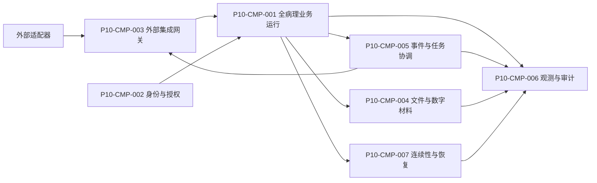

# P10 全病理组件和依赖规则

文档状态：P10架构设计中
组件总数：7个逻辑运行组件
设计限制：组件是逻辑责任集合，不是服务器、部署地址或代码包。

## 1. 组件目录

| 组件编号 | 名称 | 责任 | 包含能力 | 不负责 |
|---|---|---|---|---|
| P10-CMP-001 | 全病理业务运行组件 | 承载P10-MOD-001至P10-MOD-015的领域和应用能力 | 业务命令、聚合守卫、事务协调、受控查询和业务事实 | 外部协议细节、文件二进制和部署拓扑 |
| P10-CMP-002 | 身份与授权上下文组件 | 提供认证结果、组织上下文、角色、范围、代理和高风险复核入口 | 人工/服务身份区分、授权决策上下文、授权撤销 | 详细P14权限矩阵和医学事实 |
| P10-CMP-003 | 外部集成网关组件 | 负责外部适配、防腐映射、入站原始事实、出站投递和对账入口 | 适配器、幂等、版本映射、回执和重放控制 | 外部业务事实的最终归属和核心聚合写入 |
| P10-CMP-004 | 文件与数字材料组件 | 提供文件身份、版本、完整性、可用性、引用、归档和受控访问能力 | PDF、数字切片、外部报告、证据文件的逻辑管理 | 报告医学内容和具体存储产品 |
| P10-CMP-005 | 可靠事件与任务协调组件 | 提供可靠事件发布、消费去重、任务待办、重试、补偿和人工关闭 | 事件协作、任务协调、延迟提醒和受阻队列 | 正式领域状态和业务事实归属 |
| P10-CMP-006 | 观测与审计证据组件 | 统一业务关联、指标、日志、告警、审计证据和安全操作记录 | 业务观测、审计查询、完整性检查和告警 | 业务事实修改和外部监控产品 |
| P10-CMP-007 | 连续性与恢复协调组件 | 提供备份触发、恢复批次、差异校验、隔离和分级开放协调 | 业务/文件/事件/审计校验和恢复证据 | 未核验数据的生产放行和具体备份产品 |

## 2. 依赖方向

领域事实只被全病理业务运行组件及其拥有模块写入。适配器只能经过网关进入应用能力，观测和恢复组件不能反向写入业务事实。

## 3. 组件内部层次

| 层次 | 允许责任 | 依赖方向 |
|---|---|---|
| 领域层 | 聚合、对象、状态机、不变量、版本和业务事实 | 不依赖外部系统 |
| 应用用例层 | 命令入口、事务协调、授权检查、事件发布 | 调用领域层和受控端口 |
| 端口层 | 身份、文件、事件、设备、外部机构、观测和恢复能力 | 只表达能力，不表达具体协议 |
| 适配层 | 外部身份、编码、状态、版本、错误和回执映射 | 依赖端口，不被领域层依赖 |
| 查询层 | 按责任、对象、状态、版本和授权上下文提供查询 | 查询不能成为事实写入入口 |
| 观测层 | 关联、指标、审计、告警和恢复证据 | 追加证据，不改变业务事实 |

## 4. 模块依赖矩阵

| 调用方 | 被调用模块/组件 | 目的 | 同步/异步 | 读取/写入边界 | 失败影响 | 循环检查 |
|---|---|---|---|---|---|---|
| P10-MOD-001 | MOD-002 | 建立标本前置上下文 | 同步命令 | 通过公开应用能力 | 标本入口待处理 | 无 |
| P10-MOD-002 | MOD-003/004/005/006 | 交出已接收材料责任 | 异步事件+受控查询 | 不写下游聚合 | 单标本路径受阻 | 无 |
| P10-MOD-003 | MOD-010 | 请求扫描和读取数字材料可用性 | 异步事件 | 只引用实际玻片 | 实体诊断可继续 | 无 |
| P10-MOD-004 | MOD-003 | 冰剩转常规 | 受控命令 | 通过材料应用能力 | 当前轮次保留 | 无 |
| P10-MOD-005 | MOD-008 | 交出筛查/复核完成事实 | 异步事件 | 不写诊断记录 | 诊断待接管 | 无 |
| P10-MOD-006 | MOD-007/008 | 交出有效结果或外送关系 | 异步事件 | 结果与判读分层 | 分子路径待处理 | 无 |
| P10-MOD-007 | MOD-008 | 交出外部结果核验事实 | 异步事件 | 外部来源不可改写 | 本地判读待核验 | 无 |
| P10-MOD-008 | MOD-009/010/011 | 固定综合引用、文件和回传请求 | 异步事件 | 只引用版本和事件 | 报告本地事实保留 | 无 |
| P10-MOD-012 | 各主责任模块 | 请求隔离、纠错或质量影响 | 受控命令 | 主模块保留原事实 | 关联对象受限 | 无 |
| P10-MOD-013 | 各主责任模块 | 提供授权、代理和复核上下文 | 同步 | 不写医学事实 | 高风险动作被阻断 | 无 |
| P10-MOD-014 | 各主责任模块 | 请求冻结、恢复校验和分级开放 | 受控命令 | 只能形成治理事实 | 关联范围隔离 | 无 |
| P10-MOD-015 | MOD-008/011 | 提供模板、呈现和配置 | 受控查询/事件 | 不能改报告版本事实 | 呈现受阻 | 无 |

## 5. 架构能力目录

| 能力编号 | 能力 | 所属组件 | 主责任模块 | 下游阶段 |
|---|---|---|---|---|
| P10-CAP-001 | 本地业务命令与聚合守卫 | CMP-001 | 各主责任模块 | P11/P12/P25 |
| P10-CAP-002 | 申请和病例幂等入口 | CMP-001/003 | MOD-001 | P11/P12/P25 |
| P10-CAP-003 | 标本、材料和责任交接 | CMP-001 | MOD-002/003/004/005/006 | P11/P12/P14 |
| P10-CAP-004 | 报告版本和综合引用 | CMP-001/004 | MOD-008/009 | P11/P12/P24/P25 |
| P10-CAP-005 | 任务、运行和结果分层 | CMP-001/005 | MOD-005/006/007 | P11/P12/P25 |
| P10-CAP-006 | 文件和数字材料引用 | CMP-004 | MOD-010/015 | P11/P12/P27 |
| P10-CAP-007 | 可靠事件、消费去重和补偿 | CMP-005 | MOD-011 | P12/P25/P27 |
| P10-CAP-008 | 身份、授权、代理和复核上下文 | CMP-002 | MOD-013 | P12/P14/P25 |
| P10-CAP-009 | 质量、纠错和历史保护 | CMP-001/006 | MOD-012 | P11/P14/P25 |
| P10-CAP-010 | 业务观测和审计证据 | CMP-006 | MOD-013 | P12/P14/P25/P27 |
| P10-CAP-011 | 恢复校验和分级开放 | CMP-007 | MOD-014 | P11/P25/P27 |

## 6. 依赖门禁

- 跨模块直接写入聚合：0；
- 循环写依赖：0；
- 没有主责任模块的架构能力：0；
- 查询结果反向成为事实来源：0；
- 需要外部系统同步提交才能完成本地事实：0；
- 每个模块均有失败影响和替代路径说明。
