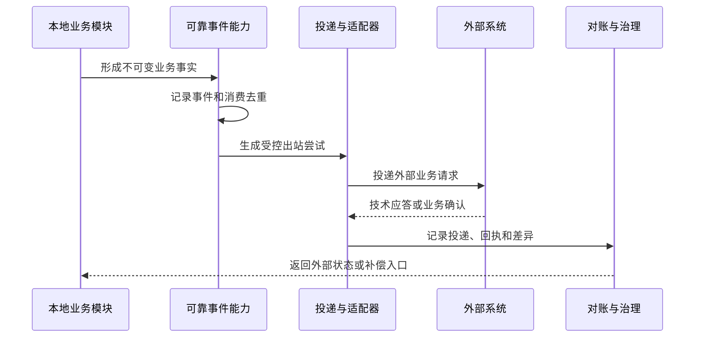

# P10 全病理事件与外部集成架构

文档状态：P10架构设计中
架构事件总数：21
事件原则：事件来自跨模块责任交接、外部集成、可靠投递、对账或必须独立观察的业务事实，不为每个状态转换机械创建事件。

## 1. 事件目录

| 事件编号 | 事件名称 | 事实来源 | 发布模块 | 订阅方 | 不可变性 | 幂等依据 | 重放限制 | 失败方向 | 需求 |
|---|---|---|---|---|---|---|---|---|---|
| P10-EVT-001 | 申请原始事实已接收 | AGG-001 / OBJ-013 | MOD-001 | MOD-002、MOD-011 | 不可变 | 来源+外部申请标识+原始消息 | 可重放但不重复建案 | 入站异常、归并、审计 | P09-REQ-0001–0004 |
| P10-EVT-002 | 病例正式建立 | AGG-002 / OBJ-002 | MOD-001 | MOD-002、MOD-008 | 不可变 | 病例身份+申请身份+版本 | 消费只推进上下文 | 身份冲突隔离 | P09-REQ-0005–0010 |
| P10-EVT-003 | 标本接收与责任交出 | AGG-003 / OBJ-003、026 | MOD-002 | MOD-003/004/005/006 | 不可变 | 标本身份+交接事实 | 同一交接只确认一次 | 标本差异、责任待接收 | P09-REQ-0011–0020 |
| P10-EVT-004 | 外部材料核验完成 | AGG-003/017 / OBJ-014、063 | MOD-002/007 | MOD-003/006/008 | 不可变 | 外部来源+核验版本 | 旧核验不覆盖新核验 | 来源不一致隔离 | P09-REQ-0013、0048–0049 |
| P10-EVT-005 | 实际材料形成 | AGG-004/005/013 / OBJ-004、005、044 | MOD-003/005 | MOD-008/010/006 | 不可变 | 实际身份+来源+形成责任 | 重复操作形成新尝试 | 材料质量或来源异常 | P09-REQ-0021–0041 |
| P10-EVT-006 | 冰冻反馈形成 | AGG-008 / OBJ-021–023 | MOD-004 | MOD-003/008 | 不可变 | 冰冻业务+轮次+反馈版本 | 追加反馈不覆盖原意见 | 冰冻/最终差异记录 | P09-REQ-0030–0032 |
| P10-EVT-007 | 细胞充分性确认 | AGG-013/014 / OBJ-046 | MOD-005 | MOD-008 | 不可变 | 标本+制备+充分性版本 | 同一评价只能确认一个版本 | 不充分转复核或补充 | P09-REQ-0038–0041 |
| P10-EVT-008 | 细胞筛查或复核完成 | AGG-014 / OBJ-047–050 | MOD-005 | MOD-008 | 不可变 | 任务+责任+记录版本 | 重复提交引用既有记录 | 资格或责任异常 | P09-REQ-0039–0041 |
| P10-EVT-009 | 分子检测任务建立 | AGG-015 / OBJ-051 | MOD-006 | MOD-002/007/008 | 不可变 | 任务身份+材料/病例关联 | 重复请求引用原任务 | 材料或病例关系冲突 | P09-REQ-0042–0047 |
| P10-EVT-010 | 分子运行和质控事实形成 | AGG-015 / OBJ-052–054 | MOD-006 | MOD-008/012 | 不可变 | 运行+批次+质控版本 | 设备重传不重复运行 | 质控失败或批次受阻 | P09-REQ-0044–0047 |
| P10-EVT-011 | 有效分子结果确认 | AGG-015 / OBJ-055、056 | MOD-006 | MOD-008/009 | 不可变 | 有效结果+判读版本 | 重复确认不改版本 | 无效、失败、复测 | P09-REQ-0046–0047 |
| P10-EVT-012 | 外送任务交出 | AGG-017 / OBJ-060、063 | MOD-007 | MOD-006/008/011 | 不可变 | 外送记录+交接+外部标识 | 重发形成新尝试 | 交接、材料或机构异常 | P09-REQ-0048–0049 |
| P10-EVT-013 | 外部结果已接收 | AGG-017 / OBJ-061 | MOD-007 | MOD-008/009 | 不可变 | 机构+外部版本+文件完整性 | 同版本只接收一次 | 待核验或完整性失败 | P09-REQ-0048–0049 |
| P10-EVT-014 | 诊断依据已确认 | AGG-010 / OBJ-006、007 | MOD-008 | MOD-009/011 | 不可变 | 责任+依据引用+意见版本 | 重复提交形成新确认或拒绝 | 复核、分歧、纠错 | P09-REQ-0050–0054 |
| P10-EVT-015 | 报告版本已签发 | AGG-011 / OBJ-008、009 | MOD-008 | MOD-004/005/006/007/011 | 不可变 | 报告版本+责任+授权 | 同一签发命令只产生一个版本 | 签发前阻断或签发后新版本 | P09-REQ-0055–0057 |
| P10-EVT-016 | 报告受控版本事件形成 | AGG-011 / OBJ-008、009 | MOD-008 | MOD-009/011/015 | 不可变 | 原版本+新事件+原因 | 重复命令引用原事件 | 补充、更正、撤回、重新签发 | P09-REQ-0058–0060 |
| P10-EVT-017 | 多模态诊断上下文固定 | AGG-018 / OBJ-062 | MOD-009 | MOD-008/006/007 | 不可变 | 组成版本集合+外部依据 | 同一组成版本集合只固定一次 | 迟到结果形成新上下文 | P09-REQ-0050–0054 |
| P10-EVT-018 | 数字材料可用性确认 | AGG-006 / OBJ-018–020 | MOD-010 | MOD-008/011 | 不可变 | 扫描尝试+文件版本+质量 | 重扫为新尝试，重传不替换引用 | 文件损坏、质量不通过 | P09-REQ-0027–0029 |
| P10-EVT-019 | 出站投递请求已形成 | AGG-012 / OBJ-032、033 | MOD-011 | 外部适配器、MOD-008 | 不可变 | 事件版本+目标+投递尝试 | 同目标同版本去重 | 重试、死信、人工重放 | P09-REQ-0058–0069 |
| P10-EVT-020 | 外部业务对账完成 | AGG-012 / OBJ-034 | MOD-011 | MOD-001/007/008/014 | 不可变 | 对账批次+外部证据+差异版本 | 同一回执不重复关闭 | 差异进入人工处置 | P09-REQ-0060–0069 |
| P10-EVT-021 | 治理事实已形成 | OBJ-027–031、035–037 | MOD-012/013/014 | 受影响主责任模块、MOD-006 | 不可变 | 治理记录+责任+影响范围+版本 | 同一治理命令不重复生效 | 隔离、纠错、恢复校验或关闭 | P09-REQ-0061–0087 |

## 2. 事件生命周期

技术应答不等同于外部业务确认；任何外部失败均不删除本地事实。

## 3. 可靠发布边界

1. 主责任模块先完成本地业务事实；
2. 事件记录引用来源对象、聚合、版本、责任和事件身份；
3. 可靠事件能力确认事件已进入可消费范围；
4. 消费者以事件身份和来源版本去重；
5. 消费失败形成处理状态、重试或受阻记录；
6. 超过配置边界后进入人工介入和对账；
7. 事件重放只产生新的处理尝试，不产生新的申请、材料、诊断或报告业务事实。

## 4. 版本、迟到和撤回

| 情形 | 架构行为 |
|---|---|
| 事件版本已被消费 | 记录重复消费结果，不重新改变业务事实 |
| 迟到旧版本 | 与当前有效版本比较，形成冲突或对账，不覆盖新版本 |
| 事件发布后本地事实受控纠错 | 发布新的纠错、撤回或替代事件，原事件仍保留 |
| 报告撤回 | 形成报告受控版本事件和外部回传事件，不删除原报告版本 |
| 外部结果修订 | 保留原始外部结果，接收新外部版本并重新核验 |
| 事件无法投递 | 本地事实保持有效，投递记录进入重试、受阻或人工关闭 |
| 文件或数字材料异常 | 保留文件和引用事实，形成质量/可用性事件，不静默替换 |

## 5. 外部适配器责任

| 适配器编号 | 适配器 | 逻辑责任 | 不得做的事 |
|---|---|---|---|
| P10-ADP-001 | 医院身份认证适配器 | 认证、组织上下文、撤销和过期映射 | 直接授予医学责任 |
| P10-ADP-002 | HIS/EMR适配器 | 患者、就诊、申请和报告映射 | 用外部状态覆盖本地历史 |
| P10-ADP-003 | 临床申请适配器 | 原始入站申请和幂等键提取 | 直接创建下级材料事实 |
| P10-ADP-004 | 收费/医嘱适配器 | 项目、医嘱和收费关联 | 把收费状态当作诊断事实 |
| P10-ADP-005 | LIS适配器 | 检验、分子或关联结果映射 | 把外部结果变成本地运行事实 |
| P10-ADP-006 | 报告调阅适配器 | 报告版本、访问上下文和回传 | 绕过报告授权 |
| P10-ADP-007 | 扫描平台适配器 | 扫描任务、数字材料和质量回执 | 静默替换已引用数字版本 |
| P10-ADP-008 | 制片染色设备适配器 | 技术目标、执行尝试和回执 | 修改实际材料来源 |
| P10-ADP-009 | 分子设备适配器 | 任务、运行、质控和原始结果映射 | 直接确认医学有效结果 |
| P10-ADP-010 | 外送机构适配器 | 外送交接、外部报告和剩余材料状态 | 将外部结果伪装成本地结果 |
| P10-ADP-011 | 文件存储适配器 | 文件保存、读取、完整性和可用性 | 成为唯一业务事实来源 |
| P10-ADP-012 | 消息平台适配器 | 路由、投递、技术回执和重试 | 把技术回执当作业务确认 |
| P10-ADP-013 | 观测平台适配器 | 指标、日志、告警和关联 | 记录未经脱敏的敏感业务内容 |
| P10-ADP-014 | 备份恢复平台适配器 | 备份、恢复批次和校验结果 | 未经业务校验宣布放行 |

适配器数量：14。具体协议、字段和外部契约留给P12；运行拓扑和平台规格留给P27。

## 6. 敏感性和重放

事件只携带完成协作所需的引用、版本、来源和责任上下文。敏感内容按P14授权和P12契约边界传递；原始消息和外部文件可以受控留存，但不能进入普通日志。重放前必须检查事件版本、授权、影响范围和当前对象状态。

## 7. 对账边界

对账至少比较本地事件版本、目标、投递尝试、技术应答、外部业务确认、外部版本和本地有效版本。差异由P10-MOD-011形成P05-AGG-012事实，必要时由P10-MOD-012隔离或发起补偿。
