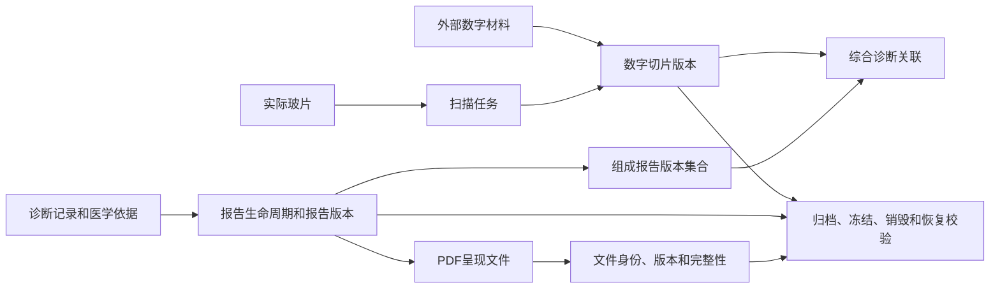

# P10 全病理报告、文件和数字切片架构

文档状态：P10架构设计中
范围：报告生命周期、PDF呈现文件、外部报告、数字切片、扫描任务和其他证据文件的逻辑能力；具体存储产品和路径留给P27。

## 1. 事实分层

| 层次 | 事实 | 主责任 | 失败时的架构行为 |
|---|---|---|---|
| 医学业务 | 诊断记录、报告版本、综合报告和组成引用 | P10-MOD-008/009 | 文件失败不回滚医学事实 |
| 文件身份 | 文件来源、类型、版本、完整性和引用关系 | P10-MOD-004 | 文件不可用形成文件异常 |
| 呈现文件 | PDF、外部报告、扫描文件和证据附件 | P10-MOD-004/015 | 生成失败可重试，原业务事实保留 |
| 数字材料 | 扫描任务、数字切片版本、外部数字材料和质量 | P10-MOD-010 | 只隔离数字路径，实体玻片和其他路径可继续 |
| 生命周期 | 使用、引用、归档、冻结、销毁和恢复校验 | P10-MOD-014 | 未通过校验的文件或业务对象分级隔离 |

## 2. 文件与业务关系

业务关系由主责任模块拥有；文件能力提供文件身份和可用性结果，不拥有医学内容。

## 3. 报告生命周期

| 业务事实 | 允许变化 | 禁止变化 |
|---|---|---|
| 草稿诊断和报告准备 | 受授权修改并形成新版本 | 冒充已签发版本 |
| 正式签发版本 | 通过补充、更正、撤回或重新签发形成新事件 | 直接覆盖正文或责任 |
| 组成报告引用 | 通过受控综合报告或新版本更新引用集合 | 静默替换被引用版本 |
| 综合报告 | 形成新的综合责任和版本 | 覆盖组织、细胞或分子组成报告 |
| 报告回传状态 | 追加投递、回执、外部确认和对账 | 改写本地有效报告事实 |

## 4. PDF和呈现文件

报告签发是医学业务事实，PDF生成是呈现文件能力，两者通过版本和引用关系关联但不在同一完成条件内。

- 签发成功后，P10-MOD-015请求P10-CMP-004生成或接收呈现文件；
- PDF生成失败形成文件任务失败和可重试事实；
- PDF成功形成文件版本和完整性校验；
- 外部回传使用报告版本和文件版本的固定引用；
- 文件损坏、丢失或不可打开时，报告仍保持原业务版本，受影响文件进入隔离或恢复；
- 新PDF只能成为新文件版本，不能静默替换已经被外部或综合报告引用的文件。

## 5. 数字切片和扫描

扫描保持可选。实际玻片可以来源于蜡块、细胞学标本、细胞学制备物或外部材料。

| 能力 | 主责任 | 事实关系 |
|---|---|---|
| 扫描请求 | P10-MOD-010 | 引用实际玻片或外部数字材料 |
| 扫描尝试 | P10-MOD-010 | 每次重扫形成新尝试，原尝试保留 |
| 文件接收 | P10-CMP-004 | 形成文件身份和完整性结果 |
| 数字切片版本 | P10-MOD-010 | 版本固定到来源和文件，历史引用不可静默替换 |
| 质量确认 | P10-MOD-010/012 | 质量不通过只隔离数字路径 |
| 诊断引用 | P10-MOD-008/009 | 引用具体数字版本，不引用易变的“当前文件” |
| 外部数字材料 | P10-MOD-010/002 | 外部来源、机构和核验事实保留 |

## 6. 文件完整性和访问

文件能力必须提供以下逻辑检查：

1. 文件身份与业务引用存在；
2. 文件版本与业务版本一致；
3. 完整性校验结果可追溯；
4. 文件格式或可打开性检查有结果；
5. 访问请求带有报告、对象、组织和授权上下文；
6. 文件不可用时形成隔离和恢复入口；
7. 孤儿文件可以被发现并进入治理流程；
8. 销毁前检查冻结、保留期、引用和外部责任；
9. 恢复后重新检查身份、版本、完整性和销毁事实。

具体文件格式、存储产品、路径和保留时长待P11/P27确认。

## 7. 归档、销毁和恢复

归档只改变可用性和治理路径，不改变业务事实。销毁动作由P10-MOD-014协调，必须经过保留期限、冻结、授权、影响范围和执行证据检查。恢复时必须重新应用撤回、作废、冻结和销毁事实，恢复文件不能自动成为可用文件。

## 8. 下游输入

- P11：报告、文件、数字切片、引用、版本和生命周期关系；
- P12：文件能力、报告事件、扫描和外部回传契约；
- P14：报告、文件、数字材料和证据访问授权；
- P24：报告阅读、文件不可用、数字材料质量和恢复状态；
- P25：版本保护、文件损坏、重扫、恢复和访问测试；
- P27：容量、备份、恢复、归档和文件治理运行能力。
