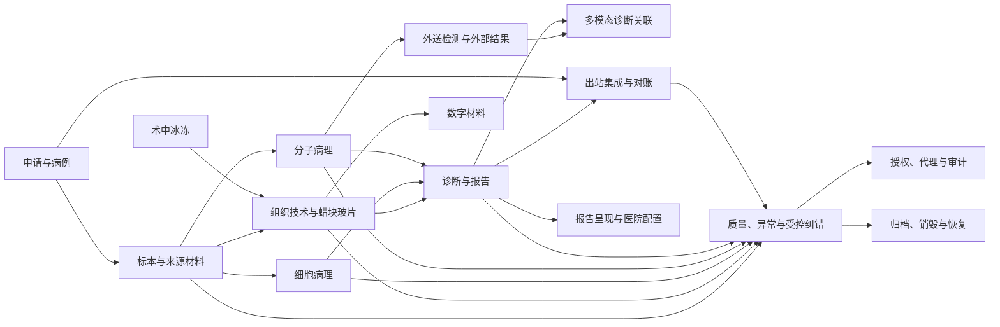

# P10 全病理系统模块边界

文档状态：P10架构设计中
逻辑模块数量：15
归属门禁：18/18聚合唯一主归属；63/63对象唯一主责任模块；31/31状态机唯一拥有模块；107/107需求具有主责任模块。

## 1. 模块目录

| 模块编号 | 名称 | 拥有聚合 | 主要对象 | 拥有状态机 | 主要责任 | 不负责 |
|---|---|---|---|---|---|---|
| P10-MOD-001 | 申请与病例 | AGG-001、AGG-002 | OBJ-001、002、010–013 | P08-SM-001、P08-SM-002 | 申请接收、幂等、病例建立、患者/就诊上下文和病例级纠错 | 不拥有标本、诊断或报告医学事实 |
| P10-MOD-002 | 标本与来源材料 | AGG-003 | OBJ-003、014、038 | P08-SM-003、P08-SM-031 | 标本接收、来源、外部材料核验和责任交接 | 不拥有蜡块、玻片或检测事实 |
| P10-MOD-003 | 组织技术与蜡块玻片 | AGG-004、AGG-005、AGG-007 | OBJ-004、005、015–017、024、039–041 | P08-SM-004、005、007、023 | 取材、处理、包埋、技术医嘱、实际玻片和设备任务协调 | 不拥有诊断结论、文件版本或外部回传 |
| P10-MOD-004 | 术中冰冻 | AGG-008 | OBJ-021–023 | P08-SM-010、P08-SM-011 | 冰冻业务、轮次、反馈、差异和冰剩转常规 | 不拥有最终报告医学版本 |
| P10-MOD-005 | 细胞病理 | AGG-013、AGG-014 | OBJ-044–050 | P08-SM-012–016 | 直接涂片、液基、充分性、筛查、复核和细胞责任 | 不把制备物、筛查或复核写成最终诊断 |
| P10-MOD-006 | 分子病理 | AGG-015、AGG-016 | OBJ-051–059 | P08-SM-013、P08-SM-024–026 | 材料选择、派生材料、提取物、任务、运行、质控、结果和判读 | 不拥有外部机构事实或组成报告版本 |
| P10-MOD-007 | 外送检测与外部结果 | AGG-017 | OBJ-060、061、063 | P08-SM-027、P08-SM-031 | 外送交接、外部报告、剩余材料和本地核验 | 不伪装本地执行事实 |
| P10-MOD-008 | 诊断与报告 | AGG-009、AGG-010、AGG-011 | OBJ-006–009 | P08-SM-006、P08-SM-017、P08-SM-028、P08-SM-029 | 诊断责任、诊断记录、报告生命周期和报告版本 | 不拥有PDF二进制存储或外部投递状态 |
| P10-MOD-009 | 多模态诊断关联 | AGG-018 | OBJ-062 | 无独立新增状态机；引用P08-SM-017、028、029 | 组织、细胞、分子和外部依据的固定关联及综合报告输入 | 不合并组成对象身份 |
| P10-MOD-010 | 数字材料 | AGG-006 | OBJ-018–020 | P08-SM-008、P08-SM-009 | 扫描任务、数字切片版本、外部数字材料、质量和引用保护 | 不把扫描结果当作医学判读 |
| P10-MOD-011 | 出站集成与对账 | AGG-012 | OBJ-032–034、043 | P08-SM-018 | 出站事件、投递、回执、重试、重放和对账 | 不改变来源模块的本地业务事实 |
| P10-MOD-012 | 质量、异常与受控纠错 | 无新增P05聚合；治理记录协调 | OBJ-027–029 | P08-SM-019、P08-SM-020 | 异常隔离、质量调查、纠错批准、影响评估和关闭 | 不替代对象所属模块的状态事实 |
| P10-MOD-013 | 授权、代理与审计 | 无新增P05聚合；治理记录协调 | OBJ-025、026、030、031 | 引用P08-SM-019、P08-SM-020 | 认证上下文、授权、代理、强认证、复核和审计证据 | 不自动取得医学责任 |
| P10-MOD-014 | 归档、销毁与恢复 | 无新增P05聚合；治理记录协调 | OBJ-035–037 | P08-SM-021、P08-SM-022、P08-SM-030 | 冻结、销毁、备份恢复、业务校验和分级开放 | 不直接宣布恢复后的业务有效性 |
| P10-MOD-015 | 报告呈现与医院配置 | 无新增P05聚合；配置边界协调 | OBJ-042 | 引用P08-SM-017、P08-SM-028 | 报告模板版本、PDF呈现文件、提醒、编号和机构配置 | 不改变报告正文事实、权限底线或历史版本 |

## 2. 模块关系图

图中箭头表达受控应用协作或业务事件，不表达跨模块直接写入。

## 3. 聚合唯一归属

| 聚合 | 名称 | 主责任模块 | 跨模块规则 |
|---|---|---|---|
| P05-AGG-001 | 病理申请聚合 | P10-MOD-001 | 只有主模块可改变聚合内部事实；跨模块通过应用能力、受控查询或事件 |
| P05-AGG-002 | 病理病例聚合 | P10-MOD-001 | 只有主模块可改变聚合内部事实；跨模块通过应用能力、受控查询或事件 |
| P05-AGG-003 | 标本聚合 | P10-MOD-002 | 只有主模块可改变聚合内部事实；跨模块通过应用能力、受控查询或事件 |
| P05-AGG-004 | 蜡块聚合 | P10-MOD-003 | 只有主模块可改变聚合内部事实；跨模块通过应用能力、受控查询或事件 |
| P05-AGG-005 | 实际玻片聚合 | P10-MOD-003 | 只有主模块可改变聚合内部事实；跨模块通过应用能力、受控查询或事件 |
| P05-AGG-006 | 数字材料聚合 | P10-MOD-010 | 只有主模块可改变聚合内部事实；跨模块通过应用能力、受控查询或事件 |
| P05-AGG-007 | 技术医嘱聚合 | P10-MOD-003 | 只有主模块可改变聚合内部事实；跨模块通过应用能力、受控查询或事件 |
| P05-AGG-008 | 术中冰冻业务聚合 | P10-MOD-004 | 只有主模块可改变聚合内部事实；跨模块通过应用能力、受控查询或事件 |
| P05-AGG-009 | 诊断责任聚合 | P10-MOD-008 | 只有主模块可改变聚合内部事实；跨模块通过应用能力、受控查询或事件 |
| P05-AGG-010 | 诊断记录聚合 | P10-MOD-008 | 只有主模块可改变聚合内部事实；跨模块通过应用能力、受控查询或事件 |
| P05-AGG-011 | 报告生命周期聚合 | P10-MOD-008 | 只有主模块可改变聚合内部事实；跨模块通过应用能力、受控查询或事件 |
| P05-AGG-012 | 出站业务事件边界 | P10-MOD-011 | 只有主模块可改变聚合内部事实；跨模块通过应用能力、受控查询或事件 |
| P05-AGG-013 | 细胞学制备与材料聚合 | P10-MOD-005 | 只有主模块可改变聚合内部事实；跨模块通过应用能力、受控查询或事件 |
| P05-AGG-014 | 细胞学筛查与复核责任聚合 | P10-MOD-005 | 只有主模块可改变聚合内部事实；跨模块通过应用能力、受控查询或事件 |
| P05-AGG-015 | 分子检测任务与运行聚合 | P10-MOD-006 | 只有主模块可改变聚合内部事实；跨模块通过应用能力、受控查询或事件 |
| P05-AGG-016 | 分子材料与分析物聚合 | P10-MOD-006 | 只有主模块可改变聚合内部事实；跨模块通过应用能力、受控查询或事件 |
| P05-AGG-017 | 外送检测与外部结果聚合 | P10-MOD-007 | 只有主模块可改变聚合内部事实；跨模块通过应用能力、受控查询或事件 |
| P05-AGG-018 | 多模态诊断关联聚合 | P10-MOD-009 | 只有主模块可改变聚合内部事实；跨模块通过应用能力、受控查询或事件 |

## 4. 对象主责任归属（63/63）

| 对象编号 | 对象名称 | 主责任模块 | 归属依据 | 后续阶段 |
|---|---|---|---|---|
| OBJ-001 | 病理申请 | P10-MOD-001 | P05对象目录与聚合边界；主模块负责写入事实，其他模块只能受控引用 | P11/P12/P14/P25 |
| OBJ-002 | 病理病例 | P10-MOD-001 | P05对象目录与聚合边界；主模块负责写入事实，其他模块只能受控引用 | P11/P12/P14/P25 |
| OBJ-003 | 标本 | P10-MOD-002 | P05对象目录与聚合边界；主模块负责写入事实，其他模块只能受控引用 | P11/P12/P14/P25 |
| OBJ-004 | 蜡块业务记录 | P10-MOD-003 | P05对象目录与聚合边界；主模块负责写入事实，其他模块只能受控引用 | P11/P12/P14/P25 |
| OBJ-005 | 实际玻片 | P10-MOD-003 | P05对象目录与聚合边界；主模块负责写入事实，其他模块只能受控引用 | P11/P12/P14/P25 |
| OBJ-006 | 诊断任务或诊断责任对象 | P10-MOD-008 | P05对象目录与聚合边界；主模块负责写入事实，其他模块只能受控引用 | P11/P12/P14/P25 |
| OBJ-007 | 诊断记录 | P10-MOD-008 | P05对象目录与聚合边界；主模块负责写入事实，其他模块只能受控引用 | P11/P12/P14/P25 |
| OBJ-008 | 报告生命周期 | P10-MOD-008 | P05对象目录与聚合边界；主模块负责写入事实，其他模块只能受控引用 | P11/P12/P14/P25 |
| OBJ-009 | 报告版本 | P10-MOD-008 | P05对象目录与聚合边界；主模块负责写入事实，其他模块只能受控引用 | P11/P12/P14/P25 |
| OBJ-010 | 患者引用 | P10-MOD-001 | P05对象目录与聚合边界；主模块负责写入事实，其他模块只能受控引用 | P11/P12/P14/P25 |
| OBJ-011 | 就诊引用 | P10-MOD-001 | P05对象目录与聚合边界；主模块负责写入事实，其他模块只能受控引用 | P11/P12/P14/P25 |
| OBJ-012 | 患者与就诊快照 | P10-MOD-001 | P05对象目录与聚合边界；主模块负责写入事实，其他模块只能受控引用 | P11/P12/P14/P25 |
| OBJ-013 | 外部申请标识 | P10-MOD-001 | P05对象目录与聚合边界；主模块负责写入事实，其他模块只能受控引用 | P11/P12/P14/P25 |
| OBJ-014 | 外部材料标识 | P10-MOD-002 | P05对象目录与聚合边界；主模块负责写入事实，其他模块只能受控引用 | P11/P12/P14/P25 |
| OBJ-015 | 技术医嘱 | P10-MOD-003 | P05对象目录与聚合边界；主模块负责写入事实，其他模块只能受控引用 | P11/P12/P14/P25 |
| OBJ-016 | 技术执行记录 | P10-MOD-003 | P05对象目录与聚合边界；主模块负责写入事实，其他模块只能受控引用 | P11/P12/P14/P25 |
| OBJ-017 | 计划玻片 | P10-MOD-003 | P05对象目录与聚合边界；主模块负责写入事实，其他模块只能受控引用 | P11/P12/P14/P25 |
| OBJ-018 | 扫描任务 | P10-MOD-010 | P05对象目录与聚合边界；主模块负责写入事实，其他模块只能受控引用 | P11/P12/P14/P25 |
| OBJ-019 | 数字切片版本 | P10-MOD-010 | P05对象目录与聚合边界；主模块负责写入事实，其他模块只能受控引用 | P11/P12/P14/P25 |
| OBJ-020 | 外部数字材料 | P10-MOD-010 | P05对象目录与聚合边界；主模块负责写入事实，其他模块只能受控引用 | P11/P12/P14/P25 |
| OBJ-021 | 冰冻业务 | P10-MOD-004 | P05对象目录与聚合边界；主模块负责写入事实，其他模块只能受控引用 | P11/P12/P14/P25 |
| OBJ-022 | 冰冻轮次 | P10-MOD-004 | P05对象目录与聚合边界；主模块负责写入事实，其他模块只能受控引用 | P11/P12/P14/P25 |
| OBJ-023 | 冰冻材料或轮次材料记录 | P10-MOD-004 | P05对象目录与聚合边界；主模块负责写入事实，其他模块只能受控引用 | P11/P12/P14/P25 |
| OBJ-024 | 组织处理批次 | P10-MOD-003 | P05对象目录与聚合边界；主模块负责写入事实，其他模块只能受控引用 | P11/P12/P14/P25 |
| OBJ-025 | 操作责任记录 | P10-MOD-013 | P05对象目录与聚合边界；主模块负责写入事实，其他模块只能受控引用 | P11/P12/P14/P25 |
| OBJ-026 | 交接记录 | P10-MOD-013 | P05对象目录与聚合边界；主模块负责写入事实，其他模块只能受控引用 | P11/P12/P14/P25 |
| OBJ-027 | 异常记录 | P10-MOD-012 | P05对象目录与聚合边界；主模块负责写入事实，其他模块只能受控引用 | P11/P12/P14/P25 |
| OBJ-028 | 质量事件 | P10-MOD-012 | P05对象目录与聚合边界；主模块负责写入事实，其他模块只能受控引用 | P11/P12/P14/P25 |
| OBJ-029 | 受控纠错记录 | P10-MOD-012 | P05对象目录与聚合边界；主模块负责写入事实，其他模块只能受控引用 | P11/P12/P14/P25 |
| OBJ-030 | 授权与代理记录 | P10-MOD-013 | P05对象目录与聚合边界；主模块负责写入事实，其他模块只能受控引用 | P11/P12/P14/P25 |
| OBJ-031 | 审计事件 | P10-MOD-013 | P05对象目录与聚合边界；主模块负责写入事实，其他模块只能受控引用 | P11/P12/P14/P25 |
| OBJ-032 | 出站业务事件 | P10-MOD-011 | P05对象目录与聚合边界；主模块负责写入事实，其他模块只能受控引用 | P11/P12/P14/P25 |
| OBJ-033 | 接口投递记录 | P10-MOD-011 | P05对象目录与聚合边界；主模块负责写入事实，其他模块只能受控引用 | P11/P12/P14/P25 |
| OBJ-034 | 对账差异记录 | P10-MOD-011 | P05对象目录与聚合边界；主模块负责写入事实，其他模块只能受控引用 | P11/P12/P14/P25 |
| OBJ-035 | 档案销毁记录 | P10-MOD-014 | P05对象目录与聚合边界；主模块负责写入事实，其他模块只能受控引用 | P11/P12/P14/P25 |
| OBJ-036 | 恢复任务 | P10-MOD-014 | P05对象目录与聚合边界；主模块负责写入事实，其他模块只能受控引用 | P11/P12/P14/P25 |
| OBJ-037 | 恢复校验结果 | P10-MOD-014 | P05对象目录与聚合边界；主模块负责写入事实，其他模块只能受控引用 | P11/P12/P14/P25 |
| OBJ-038 | 标本容器 | P10-MOD-002 | P05对象目录与聚合边界；主模块负责写入事实，其他模块只能受控引用 | P11/P12/P14/P25 |
| OBJ-039 | 组织盒扩展身份 | P10-MOD-003 | P05对象目录与聚合边界；主模块负责写入事实，其他模块只能受控引用 | P11/P12/P14/P25 |
| OBJ-040 | 设备任务 | P10-MOD-003 | P05对象目录与聚合边界；主模块负责写入事实，其他模块只能受控引用 | P11/P12/P14/P25 |
| OBJ-041 | 设备运行批次 | P10-MOD-003 | P05对象目录与聚合边界；主模块负责写入事实，其他模块只能受控引用 | P11/P12/P14/P25 |
| OBJ-042 | 报告模板版本与 PDF 呈现文件 | P10-MOD-015 | P05对象目录与聚合边界；主模块负责写入事实，其他模块只能受控引用 | P11/P12/P14/P25 |
| OBJ-043 | 外部系统目标 | P10-MOD-011 | P05对象目录与聚合边界；主模块负责写入事实，其他模块只能受控引用 | P11/P12/P14/P25 |
| OBJ-044 | 细胞学制备记录 | P10-MOD-005 | P05对象目录与聚合边界；主模块负责写入事实，其他模块只能受控引用 | P11/P12/P14/P25 |
| OBJ-045 | 细胞学制备物 | P10-MOD-005 | P05对象目录与聚合边界；主模块负责写入事实，其他模块只能受控引用 | P11/P12/P14/P25 |
| OBJ-046 | 标本充分性评价 | P10-MOD-005 | P05对象目录与聚合边界；主模块负责写入事实，其他模块只能受控引用 | P11/P12/P14/P25 |
| OBJ-047 | 细胞学筛查任务 | P10-MOD-005 | P05对象目录与聚合边界；主模块负责写入事实，其他模块只能受控引用 | P11/P12/P14/P25 |
| OBJ-048 | 细胞学筛查记录 | P10-MOD-005 | P05对象目录与聚合边界；主模块负责写入事实，其他模块只能受控引用 | P11/P12/P14/P25 |
| OBJ-049 | 细胞学复核任务 | P10-MOD-005 | P05对象目录与聚合边界；主模块负责写入事实，其他模块只能受控引用 | P11/P12/P14/P25 |
| OBJ-050 | 细胞学复核记录 | P10-MOD-005 | P05对象目录与聚合边界；主模块负责写入事实，其他模块只能受控引用 | P11/P12/P14/P25 |
| OBJ-051 | 分子检测任务 | P10-MOD-006 | P05对象目录与聚合边界；主模块负责写入事实，其他模块只能受控引用 | P11/P12/P14/P25 |
| OBJ-052 | 分子检测运行 | P10-MOD-006 | P05对象目录与聚合边界；主模块负责写入事实，其他模块只能受控引用 | P11/P12/P14/P25 |
| OBJ-053 | 分子设备原始结果 | P10-MOD-006 | P05对象目录与聚合边界；主模块负责写入事实，其他模块只能受控引用 | P11/P12/P14/P25 |
| OBJ-054 | 分子质控结果 | P10-MOD-006 | P05对象目录与聚合边界；主模块负责写入事实，其他模块只能受控引用 | P11/P12/P14/P25 |
| OBJ-055 | 有效分子检测结果 | P10-MOD-006 | P05对象目录与聚合边界；主模块负责写入事实，其他模块只能受控引用 | P11/P12/P14/P25 |
| OBJ-056 | 分子医学判读 | P10-MOD-006 | P05对象目录与聚合边界；主模块负责写入事实，其他模块只能受控引用 | P11/P12/P14/P25 |
| OBJ-057 | 检测材料选择记录 | P10-MOD-006 | P05对象目录与聚合边界；主模块负责写入事实，其他模块只能受控引用 | P11/P12/P14/P25 |
| OBJ-058 | 分子派生材料 | P10-MOD-006 | P05对象目录与聚合边界；主模块负责写入事实，其他模块只能受控引用 | P11/P12/P14/P25 |
| OBJ-059 | 提取物或分析物 | P10-MOD-006 | P05对象目录与聚合边界；主模块负责写入事实，其他模块只能受控引用 | P11/P12/P14/P25 |
| OBJ-060 | 外送检测记录 | P10-MOD-007 | P05对象目录与聚合边界；主模块负责写入事实，其他模块只能受控引用 | P11/P12/P14/P25 |
| OBJ-061 | 外部检测结果 | P10-MOD-007 | P05对象目录与聚合边界；主模块负责写入事实，其他模块只能受控引用 | P11/P12/P14/P25 |
| OBJ-062 | 多模态诊断关联 | P10-MOD-009 | P05对象目录与聚合边界；主模块负责写入事实，其他模块只能受控引用 | P11/P12/P14/P25 |
| OBJ-063 | 外部材料核验记录 | P10-MOD-007 | P05对象目录与聚合边界；主模块负责写入事实，其他模块只能受控引用 | P11/P12/P14/P25 |

## 5. 状态机归属（31/31）

| 状态机 | 名称 | 拥有模块 | 规则 |
|---|---|---|---|
| P08-SM-001 | 申请接收生命周期 | P10-MOD-001 | 状态事实由拥有模块维护；协调模块不得直接改写 |
| P08-SM-002 | 病例建立生命周期 | P10-MOD-001 | 状态事实由拥有模块维护；协调模块不得直接改写 |
| P08-SM-003 | 标本接收生命周期 | P10-MOD-002 | 状态事实由拥有模块维护；协调模块不得直接改写 |
| P08-SM-004 | 蜡块业务生命周期 | P10-MOD-003 | 状态事实由拥有模块维护；协调模块不得直接改写 |
| P08-SM-005 | 实际玻片生命周期 | P10-MOD-003 | 状态事实由拥有模块维护；协调模块不得直接改写 |
| P08-SM-006 | 诊断责任任务 | P10-MOD-008 | 状态事实由拥有模块维护；协调模块不得直接改写 |
| P08-SM-007 | 技术医嘱任务 | P10-MOD-003 | 状态事实由拥有模块维护；协调模块不得直接改写 |
| P08-SM-008 | 扫描任务 | P10-MOD-010 | 状态事实由拥有模块维护；协调模块不得直接改写 |
| P08-SM-009 | 数字切片版本 | P10-MOD-010 | 状态事实由拥有模块维护；协调模块不得直接改写 |
| P08-SM-010 | 冰冻业务生命周期 | P10-MOD-004 | 状态事实由拥有模块维护；协调模块不得直接改写 |
| P08-SM-011 | 冰冻轮次生命周期 | P10-MOD-004 | 状态事实由拥有模块维护；协调模块不得直接改写 |
| P08-SM-012 | 细胞学制备记录 | P10-MOD-005 | 状态事实由拥有模块维护；协调模块不得直接改写 |
| P08-SM-013 | 细胞学制备物 | P10-MOD-005 | 状态事实由拥有模块维护；协调模块不得直接改写 |
| P08-SM-014 | 充分性评价 | P10-MOD-005 | 状态事实由拥有模块维护；协调模块不得直接改写 |
| P08-SM-015 | 细胞筛查/复核任务 | P10-MOD-005 | 状态事实由拥有模块维护；协调模块不得直接改写 |
| P08-SM-016 | 细胞筛查/复核记录 | P10-MOD-005 | 状态事实由拥有模块维护；协调模块不得直接改写 |
| P08-SM-017 | 报告生命周期 | P10-MOD-008 | 状态事实由拥有模块维护；协调模块不得直接改写 |
| P08-SM-018 | 出站业务事件 | P10-MOD-011 | 状态事实由拥有模块维护；协调模块不得直接改写 |
| P08-SM-019 | 质量事件 | P10-MOD-012 | 状态事实由拥有模块维护；协调模块不得直接改写 |
| P08-SM-020 | 受控纠错 | P10-MOD-012 | 状态事实由拥有模块维护；协调模块不得直接改写 |
| P08-SM-021 | 档案销毁任务 | P10-MOD-014 | 状态事实由拥有模块维护；协调模块不得直接改写 |
| P08-SM-022 | 恢复任务 | P10-MOD-014 | 状态事实由拥有模块维护；协调模块不得直接改写 |
| P08-SM-023 | 设备任务 | P10-MOD-003 | 状态事实由拥有模块维护；协调模块不得直接改写 |
| P08-SM-024 | 分子检测任务 | P10-MOD-006 | 状态事实由拥有模块维护；协调模块不得直接改写 |
| P08-SM-025 | 分子检测运行 | P10-MOD-006 | 状态事实由拥有模块维护；协调模块不得直接改写 |
| P08-SM-026 | 有效分子结果 | P10-MOD-006 | 状态事实由拥有模块维护；协调模块不得直接改写 |
| P08-SM-027 | 外送检测记录 | P10-MOD-007 | 状态事实由拥有模块维护；协调模块不得直接改写 |
| P08-SM-028 | 报告版本 | P10-MOD-008 | 状态事实由拥有模块维护；协调模块不得直接改写 |
| P08-SM-029 | 诊断记录快照 | P10-MOD-008 | 状态事实由拥有模块维护；协调模块不得直接改写 |
| P08-SM-030 | 恢复校验 | P10-MOD-014 | 状态事实由拥有模块维护；协调模块不得直接改写 |
| P08-SM-031 | 外部材料核验 | P10-MOD-002 | 状态事实由拥有模块维护；协调模块不得直接改写 |

## 6. 模块内部责任结构

每个模块内部都保持以下逻辑层次：

| 层次 | 责任 | 禁止事项 |
|---|---|---|
| 领域事实 | 维护本模块拥有对象、聚合和状态机的不变量 | 不依赖外部系统细节 |
| 应用能力 | 接收业务命令、组织事务、发布事实和协调授权 | 不直接让外部输入改写事实 |
| 查询能力 | 提供受控的病例、任务、材料、报告和治理查询 | 查询结果不成为写入事实 |
| 端口 | 定义外部能力、文件、事件、身份和观测协作边界 | 不写具体协议细节 |
| 外部适配器 | 映射外部身份、编码、版本、状态和错误 | 不将外部状态直接当成本地状态 |
| 配置能力 | 承载医院显示、分工、提醒、机构和非核心阈值 | 不关闭身份、来源、责任、版本和安全底线 |

## 7. 业务操作入口责任

| 入口类别 | 主模块 | 协作模块 | 事务策略 |
|---|---|---|---|
| 申请接收、幂等、病例建立 | P10-MOD-001 | MOD-002、MOD-011、MOD-013 | 申请/病例聚合内强一致；外部回传最终一致 |
| 标本接收、分类和交接 | P10-MOD-002 | MOD-001、MOD-012、MOD-013 | 标本聚合内强一致；责任交接形成可审计事实 |
| 组织、冰冻和细胞材料 | MOD-003/004/005 | MOD-002、MOD-012 | 各材料路径本地强一致；跨路径事件协调 |
| 分子和外送检测 | MOD-006/007 | MOD-002、MOD-005、MOD-008 | 任务/运行/结果分层；外部最终一致 |
| 诊断、报告和综合报告 | MOD-008/009 | MOD-006、MOD-007、MOD-010、MOD-015 | 报告版本本地强一致；文件生成和回传异步 |
| 纠错、授权、质量、销毁和恢复 | MOD-012/013/014 | 相关主责任模块 | 高风险操作受控授权；局部隔离和分级开放 |

## 8. 未来独立部署条件

逻辑模块只有在满足独立安全域、独立伸缩证据、独立交付节奏、明确数据归属、可接受最终一致边界和独立故障隔离时，才可评估为独立运行组件。任何拆分仍必须保留主责任模块、事件、审计、幂等和对账边界。
