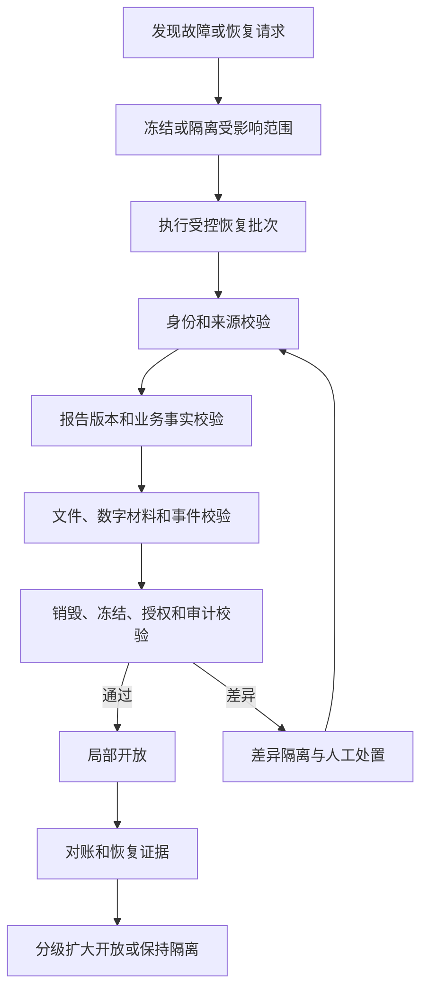

# P10 全病理可观测性、连续性和恢复架构

文档状态：P10架构设计中
范围：业务流程、事务、事件、接口、文件、设备、安全、审计、备份和恢复的逻辑观测及连续性能力。
参数状态：P09-PARAM-001至P09-PARAM-018均未确认，本文不写入任何正式数值。

## 1. 可观测性维度

| 维度编号 | 观测对象 | 关键观测 | 主责任 | 失败时的业务保护 |
|---|---|---|---|---|
| P10-OBS-001 | 申请和病例 | 入站量、重复、归并、建立和受阻 | MOD-001 | 保留原始申请，重复不重复建案 |
| P10-OBS-002 | 标本和交接 | 接收、差异、交接、签收和责任等待 | MOD-002 | 单标本隔离，其他标本可继续 |
| P10-OBS-003 | 材料和技术 | 取材、蜡块、玻片、染色、设备任务和返工 | MOD-003 | 失败形成新尝试和局部异常 |
| P10-OBS-004 | 冰冻 | 轮次、材料、反馈、时效提醒和转常规 | MOD-004 | 当前轮次受阻，来源和反馈保留 |
| P10-OBS-005 | 细胞病理 | 制备、充分性、筛查、复核和高风险积压 | MOD-005 | 责任待处理，不跳过复核 |
| P10-OBS-006 | 分子病理 | 任务、运行、质控、原始结果、有效结果和复测 | MOD-006 | 质控失败隔离，原始结果保留 |
| P10-OBS-007 | 外送 | 交接、外部状态、结果核验和剩余材料 | MOD-007 | 外部结果待核验，不伪装本地结果 |
| P10-OBS-008 | 诊断和报告 | 责任接管、版本、签发、补充、更正和撤回 | MOD-008/009 | 版本不可覆盖，报告事实保留 |
| P10-OBS-009 | 数字材料和文件 | 扫描、文件接收、完整性、质量和引用 | MOD-010/CMP-004 | 数字路径隔离，实体路径可继续 |
| P10-OBS-010 | 外部投递 | 投递尝试、技术应答、业务确认、重试和差异 | MOD-011 | 本地事实不回滚，进入对账 |
| P10-OBS-011 | 安全操作 | 授权拒绝、代理、强认证、复核和越权尝试 | MOD-013 | 高风险动作阻断并审计 |
| P10-OBS-012 | 异常和质量 | 影响范围、隔离、纠正、关闭和复发 | MOD-012 | 局部隔离，责任和证据保留 |
| P10-OBS-013 | 审计完整性 | 审计写入、缺失、篡改和查询导出 | MOD-013/CMP-006 | 审计缺口形成治理异常 |
| P10-OBS-014 | 归档销毁 | 冻结、保留、销毁审批、执行和证据 | MOD-014 | 条件不足时阻断销毁 |
| P10-OBS-015 | 恢复 | 恢复批次、身份、版本、文件、事件和授权校验 | MOD-014/CMP-007 | 差异隔离，分级开放 |
| P10-OBS-016 | 任务积压 | 待处理、受阻、超时、重试和人工接管 | CMP-005 | 只影响关联任务，不改变领域状态 |
| P10-OBS-017 | 容量 | 请求、文件、事件、任务、业务对象和增长趋势 | CMP-006 | 先测量再扩展，不能伪造容量结论 |
| P10-OBS-018 | 连续性 | 外部不可用、降级、恢复后对账和重新开放 | CMP-007 | 分级开放和证据化恢复 |

## 2. 统一关联能力

每个业务观测、审计或恢复证据至少可以按以下关联维度追踪：

- 请求或操作关联；
- 患者、申请、病例和标本关联；
- 材料、任务、运行和结果关联；
- 诊断、报告和文件版本关联；
- 事件、投递、回执和对账关联；
- 异常、质量、纠错和责任关联；
- 恢复任务、恢复批次和校验结果关联。

关联标识只用于追溯和观测，不替代对象身份、业务编号或报告版本。

## 3. 参数到可测量点

| 参数 | 可测量点 | 可配置边界 | 未确认前行为 | 责任和后续 |
|---|---|---|---|---|
| P09-PARAM-001 交互响应时间 | 业务操作从受理到可观察结果 | 操作类别、告警和采样 | 只记录测量，不承诺数值 | 产品负责人/P24/P25 |
| P09-PARAM-002 批量操作时限 | 批量任务接收、完成和受阻 | 批量类别、分段和告警 | 允许拆分和观测 | 产品负责人/P25/P27 |
| P09-PARAM-003 报告生成时限 | 签发到呈现文件可用 | 报告类型和生成任务 | 签发不依赖PDF完成 | 产品负责人/P19/P25 |
| P09-PARAM-004 接口自动重试次数 | 投递尝试序列和最终结果 | 目标、错误类别和上限配置 | 进入受阻或人工入口 | 产品负责人/P12/P27 |
| P09-PARAM-005 接口重试间隔 | 单次投递之间的时间测量 | 目标、错误类别和调度规则 | 不硬编码正式间隔 | 产品负责人/P12/P27 |
| P09-PARAM-006 对账周期 | 本地事件到对账批次完成 | 外部目标和对账批次 | 支持手工对账 | 产品负责人/P12/P27 |
| P09-PARAM-007 冰冻时效提醒阈值 | 冰冻业务、轮次和反馈时间 | 病理类型、轮次和通知范围 | 仅提供提醒能力 | 病理负责人/P20/P25 |
| P09-PARAM-008 任务逾期提醒阈值 | 任务接管到完成或升级 | 任务类别和责任范围 | 记录逾期，不自动改变状态 | 产品负责人/P14/P25 |
| P09-PARAM-009 阴性细胞学质量抽查比例 | 阴性病例样本和抽查结果 | 抽查范围和随机规则 | 由责任人确认策略 | 病理负责人/P14/P25 |
| P09-PARAM-010 数字切片质量阈值 | 文件完整性、可打开性和图像质量 | 设备、用途和质量分级 | 未通过时隔离 | 数字病理负责人/P21/P25 |
| P09-PARAM-011 分子质控阈值 | 批次质控与样本结果关系 | 方法、项目和释放条件 | 不形成有效结果 | 分子负责人/P18/P25 |
| P09-PARAM-012 自动复测次数 | 任务、运行和复测尝试序列 | 项目、失败类别和材料条件 | 超出授权转人工 | 分子负责人/P18/P25 |
| P09-PARAM-013 材料最小量 | 材料选择、消耗和剩余量 | 材料类型和方法 | 材料不足转授权决定 | 分子负责人/P16/P23 |
| P09-PARAM-014 材料和档案保存期限 | 保存起点、冻结和销毁资格 | 材料、报告和法规范围 | 未确认不销毁 | 产品负责人/P23/P27 |
| P09-PARAM-015 并发用户 | 人工会话、业务操作和冲突 | 组织、工作站和资源隔离 | 只测量和告警 | 产品负责人/P25/P27 |
| P09-PARAM-016 业务容量 | 病例、材料、文件、事件和任务增长 | 业务类型和资源类别 | 记录趋势，不宣称上限 | 产品负责人/P11/P27 |
| P09-PARAM-017 RPO | 业务事实、文件、事件和审计恢复点 | 数据类别和恢复批次 | 设计分级恢复 | 产品负责人/P23/P27 |
| P09-PARAM-018 RTO | 恢复校验到分级开放的耗时 | 开放级别和业务范围 | 不宣称恢复目标 | 产品负责人/P23/P27 |

## 4. 连续性场景

| 场景 | 保持可用的本地能力 | 受阻范围 | 恢复后动作 |
|---|---|---|---|
| 外部申请系统不可用 | 手工受控申请、原始事实、病例和标本接收 | 外部上下文自动补全 | 补录、幂等和对账 |
| 接口平台不可用 | 本地事实、出站事件、待投递和人工查看 | 外部发送 | 重试、补发和对账 |
| 扫描系统不可用 | 实体玻片、显微诊断和扫描待办 | 数字切片路径 | 新扫描尝试和质量核验 |
| 设备不可用 | 任务、材料、责任和人工替代入口 | 对应设备任务 | 回执补录、异常和质量评估 |
| 文件能力不可用 | 报告版本、业务元数据和文件待恢复 | 文件读取/生成 | 完整性校验和受控恢复 |
| 单检测任务失败 | 其他任务、病例和已形成结果 | 关联任务 | 复测、补测或受控关闭 |
| 后台任务积压 | 主责任模块和待办查询 | 异步协作完成 | 分级补偿和人工接管 |
| 部分数据或文件恢复 | 恢复批次、差异和隔离查询 | 未通过校验范围 | 身份/版本/文件/审计校验 |
| 恢复后开放 | 已校验的局部业务能力 | 未校验关联范围 | 局部开放→扩大开放→对账 |

## 5. 恢复流程

恢复完成条件不是“数据已复制”，而是身份、来源、版本、文件、事件、授权、销毁和审计关系均完成规定校验。

## 6. 下游输入

P11接收恢复校验涉及的对象和版本关系；P12接收投递、回执和重放观测；P14接收安全操作和恢复放行点；P24接收降级、积压和文件不可用提示；P25接收连续性、恢复和容量测量入口；P27接收备份、监控、恢复批次和分级开放能力。
