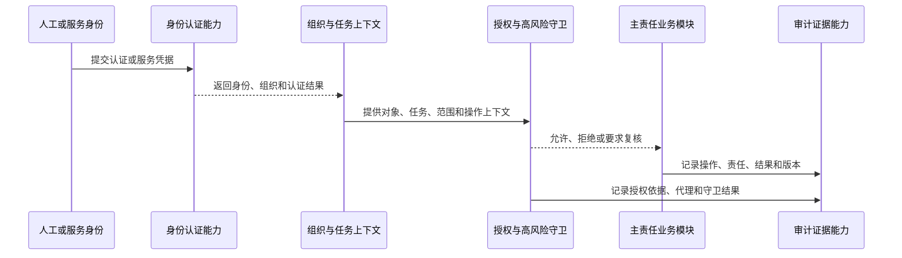

# P10 全病理安全、授权与治理架构

文档状态：P10架构设计中
边界：P10定义安全能力和责任边界；P14定义详细角色、权限点、数据范围矩阵和实施规则。

## 1. 安全能力分层

| 层次 | 能力 | 主责任 | 核心控制 |
|---|---|---|---|
| 身份 | 人工、服务、设备和接口身份 | P10-MOD-013 | 身份来源、认证结果、撤销、过期和会话关联 |
| 上下文 | 组织、科室、岗位、任务和病理类型 | P10-MOD-013 | 当前组织和责任上下文进入每次高风险判断 |
| 授权 | 角色、对象范围、数据范围和任务责任 | P10-MOD-013 | 允许/拒绝/待复核结果可追溯 |
| 代理 | 代理、临时和紧急授权 | P10-MOD-013 | 实际操作者、被代理责任、依据、起止和撤销 |
| 强认证 | 高风险操作和第二人复核 | P10-MOD-013 | 纠错、撤回、签发、销毁、恢复和越权尝试受守卫 |
| 审计 | 谁、何时、对什么、做什么、结果如何 | P10-MOD-013 | 追加证据、不可由普通业务动作修改 |
| 治理 | 异常、质量、归档、销毁和恢复 | P10-MOD-012/014 | 影响范围、隔离、校验和分级开放 |

## 2. 认证和授权流程

认证成功不等于业务授权成功；服务身份不能成为人工医学责任人。

## 3. 高风险操作架构守卫

| 操作 | 必要上下文 | 附加守卫 | 业务事实 |
|---|---|---|---|
| 患者、病例或来源纠错 | 原值、新值、来源、影响和责任 | 授权、复核、强认证 | 新纠错事实，原值保留 |
| 诊断重新确认 | 依据版本、责任、医学角色 | 复核或会诊规则 | 新诊断版本 |
| 报告签发 | 诊断、报告版本、组成依据 | 签发资格、授权和审计 | 新签发版本 |
| 撤回或重新签发 | 原版本、原因、影响范围 | 高风险授权和外部回传评估 | 受控报告事件 |
| 代理操作 | 被代理责任、起止和范围 | 代理有效、实际身份和审计 | 代理关系与业务事实分开 |
| 材料消耗或外送 | 材料来源、用途、剩余量和交接 | 材料责任和高风险条件 | 新消耗/交接事实 |
| 档案销毁 | 保留期、冻结、审批和影响范围 | 双人或高风险授权 | 销毁任务和证据 |
| 恢复放行 | 恢复批次、差异和校验 | 分级授权和业务确认 | 放行或隔离事实 |

## 4. 职责分离原则

- 身份认证人员不自动成为病例、诊断或报告责任人；
- 系统管理人员不自动拥有患者、来源、诊断、报告或质量纠错责任；
- 设备和接口身份不作为人工签发人；
- 发起纠错的人与批准高风险纠错的人可以按医院规则分离，但批准责任必须可识别；
- 审计查看、导出和治理处置本身产生审计；
- 紧急授权必须有原因、范围、有效期、实际操作者和事后复核入口。

## 5. 受控纠错和历史保护

纠错由P10-MOD-012协调，主责任模块保留原值和历史。纠错架构至少包含：

1. 发现和提交；
2. 原值、新值、来源和影响范围固定；
3. 授权、复核或拒绝；
4. 形成新事实或新版本；
5. 通知受影响流程和外部目标；
6. 对账、质量评估和关闭。

纠错不能直接写入其他模块聚合，也不能通过删除历史达到“修正”。

## 6. 审计证据结构边界

审计证据至少关联身份、组织、操作、对象、聚合、版本、来源、时间、授权、结果、失败原因和关联事件。审计与异常、质量事件、诊断记录和材料记录分开；审计证据只能追加或形成受控治理事实。

## 7. P14输入

P10向P14提供身份类型、授权上下文、责任入口、高风险动作、代理关系、强认证、第二人复核、审计事件和撤销/过期入口。P14不得改变P05身份、来源、责任和历史保护原则。
