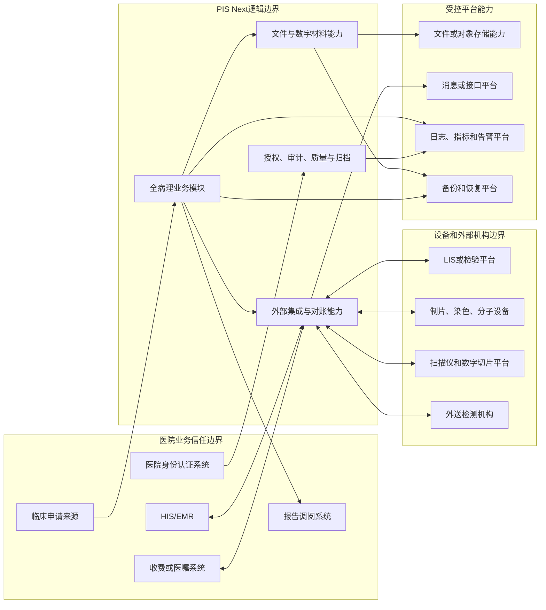
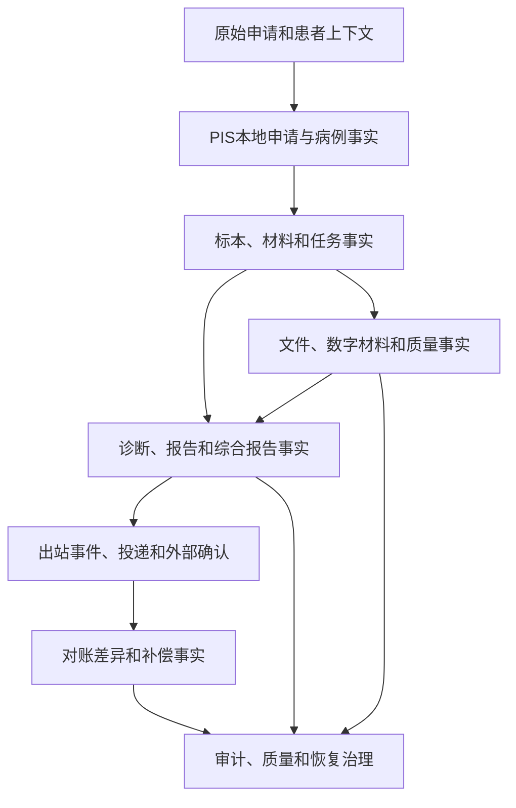

# P10 全病理系统系统上下文

文档状态：P10架构设计中
系统边界：PIS Next负责病理业务事实、责任、材料、诊断、报告、文件引用、外部协作和审计治理；外部系统事实不直接成为本地领域事实。

## 1. 系统上下文

图中只表达逻辑边界，不表达服务器、地址、部署数量、接口路径或交换字段。

## 2. 外部参与者和系统

| 编号 | 外部参与者或系统 | 提供的数据或能力 | 接收的数据或能力 | 协作倾向 | 事实归属 | 信任边界 | 失败影响 | 对账需要 | 需求来源 |
|---|---|---|---|---|---|---|---|---|---|
| P10-EXT-001 | 临床申请来源 | 患者、就诊、申请和临床上下文 | 申请接收结果、病理号或状态通知 | 入站异步/人工补录 | 原始入站由PIS保存；患者主数据由医院系统归属 | 外部入站 | 申请重复或缺失 | 申请数量和状态 | P09-REQ-0001–0010 |
| P10-EXT-002 | HIS/EMR | 患者、就诊、医嘱和临床关系 | 本地申请、报告和状态回传 | 双向协作 | PIS拥有病理业务事实 | 医院业务边界 | 身份或回传失败 | 申请、病例、报告 | P09-REQ-0001、0058–0060 |
| P10-EXT-003 | 收费或医嘱系统 | 收费、医嘱和项目状态 | 业务确认或结果关联 | 异步为主 | 外部收费事实外置，本地保留关联 | 医院业务边界 | 业务入口受限 | 申请、项目、收费状态 | P09-REQ-0001、0042–0049 |
| P10-EXT-004 | 医院身份认证系统 | 人工身份、组织和认证结果 | 认证请求、撤销或过期查询 | 同步 | 身份认证外部归属，业务授权本地归属 | 安全边界 | 用户无法进入或认证不一致 | 认证和高风险操作 | P09-REQ-0061–0069、0075–0087 |
| P10-EXT-005 | LIS或检验平台 | 检验结果、任务或关联标识 | 分子、细胞或报告相关结果 | 双向异步 | 外部结果标记外部来源 | 外部实验室边界 | 结果迟到或不一致 | 任务、结果、版本 | P09-REQ-0042–0049、0082 |
| P10-EXT-006 | 报告调阅系统 | 调阅请求、访问上下文 | 当前有效报告和可授权文件 | 同步/异步 | PIS拥有报告版本和访问决定 | 医院访问边界 | 调阅失败不回滚签发 | 报告访问和版本 | P09-REQ-0055–0060 |
| P10-EXT-007 | 扫描仪和数字切片平台 | 扫描尝试、数字材料和质量回执 | 实际玻片、扫描任务和授权引用 | 异步 | PIS拥有扫描任务和引用关系；设备拥有执行事实 | 设备边界 | 数字路径受阻，实体路径可继续 | 扫描任务和文件 | P09-REQ-0021–0029、0097 |
| P10-EXT-008 | 制片、染色和组织设备 | 执行状态、批次、质量和文件标识 | 技术目标和执行请求 | 异步/人工确认 | PIS拥有业务任务和实际材料事实 | 设备边界 | 单项技术任务受阻 | 任务、批次、异常 | P09-REQ-0021–0032 |
| P10-EXT-009 | 分子检测设备 | 运行、原始结果和质控信息 | 检测任务、材料和批次上下文 | 异步 | PIS拥有任务、有效结果和医学判读 | 设备边界 | 运行或质控失败 | 任务、运行、结果 | P09-REQ-0042–0047 |
| P10-EXT-010 | 外送检测机构 | 外部交接、外部报告和剩余材料状态 | 外送任务、材料和核验请求 | 异步 | 外部结果和交接为外部事实 | 机构边界 | 结果迟到、退回或不可核验 | 外送批次、结果和差异 | P09-REQ-0048–0049 |
| P10-EXT-011 | 文件或对象存储能力 | 文件保存、读取、完整性和生命周期能力 | PDF、数字切片、外部报告和证据文件 | 异步/受控访问 | PIS拥有业务文件引用和可用性结论 | 平台边界 | 文件路径受阻，业务事实保留 | 文件引用和校验 | P09-REQ-0055–0060、0075–0087 |
| P10-EXT-012 | 消息或接口平台 | 投递、回执、重试和路由能力 | 入站和出站业务事件 | 异步 | PIS拥有本地事件和投递责任 | 集成平台边界 | 事件积压或回执缺失 | 投递和对账 | P09-REQ-0055–0069 |
| P10-EXT-013 | 日志、指标和告警平台 | 指标、日志、告警和关联查询 | 业务、事件、安全和恢复观测事实 | 异步 | PIS拥有业务审计；平台拥有观测副本 | 运维观测边界 | 可观测性下降，不改变业务事实 | 观测完整性 | P09-REQ-0088–0103 |
| P10-EXT-014 | 备份和恢复平台 | 备份、恢复批次和校验能力 | 业务、文件、审计和恢复证据 | 异步/受控操作 | PIS拥有恢复放行和业务校验结论 | 恢复治理边界 | 恢复受限或分级开放 | 恢复批次和差异 | P09-REQ-0084–0087、0104–0105 |

## 3. 信任边界

| 边界 | 进入PIS的最小控制 | 离开PIS的最小控制 | 事实处理 |
|---|---|---|---|
| 医院身份边界 | 认证结果、组织上下文、撤销和会话关联 | 只发送必要的授权或调阅请求 | 人工身份与服务身份分离 |
| 临床业务边界 | 原始入站事实、来源、消息标识和幂等判断 | 报告或状态回传必须关联本地版本 | 外部原值不覆盖本地历史 |
| 设备边界 | 设备身份、执行尝试、批次、原始结果和质量回执 | 任务、材料、目标和允许的执行上下文 | 设备成功不等于医学结果有效 |
| 外送机构边界 | 机构身份、交接、外部标识、文件和核验事实 | 只发送经授权的材料和任务上下文 | 外部结果与本地判读分层 |
| 文件和平台边界 | 文件身份、版本、完整性、可用性和存储关系 | 只传递必要文件和访问授权 | 二进制异常不删除业务事实 |

## 4. 主要上下文关系

任何外部确认只能改变相应外部状态或对账结论，不覆盖A至D中的本地历史事实。
