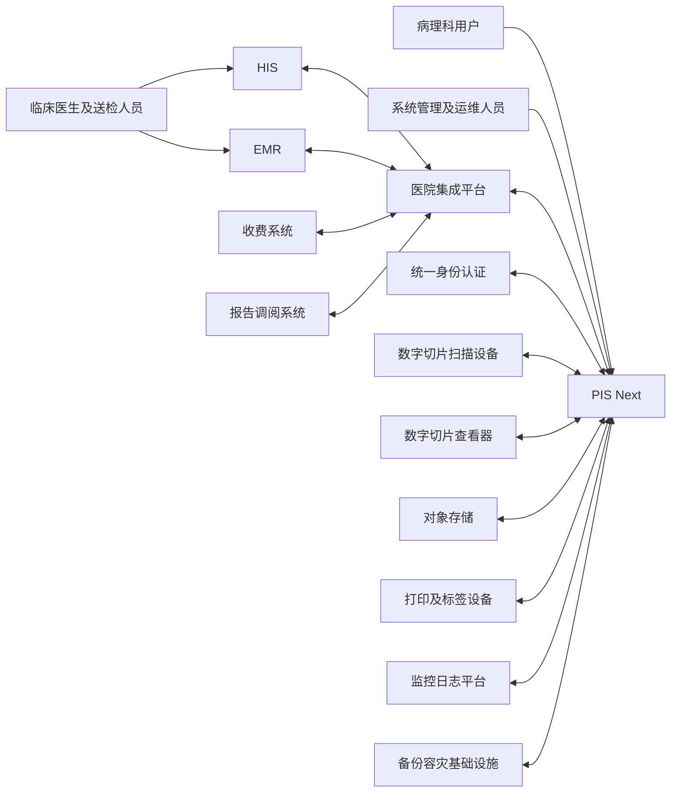

# PIS Next 系统上下文

文档状态：草稿  
文档版本：0.1  
创建日期：2026-08-05  
最后更新：2026-08-05  
负责人：项目团队  
所属阶段：P02 产品目标与系统边界  

---

## 1. 文档目的

本文定义 PIS Next 与用户、外部系统和外部设备之间的高层边界。

本文只描述系统上下文，不定义：

- 详细接口字段；
- 接口协议最终选择；
- 消息状态码；
- 数据库结构；
- 内部模块；
- 详细业务流程；
- 网络部署拓扑。

---

## 2. PIS Next 系统责任

PIS Next 负责：

1. 管理病理科核心业务对象；
2. 管理病理申请进入 PIS 后的业务处理；
3. 管理标本、蜡块、切片和数字切片追溯；
4. 管理技术处理和技术医嘱；
5. 管理冰冻业务；
6. 管理诊断和报告版本；
7. 管理病理科业务状态；
8. 管理病理业务质量事件；
9. 管理病理档案；
10. 管理 PIS 自身的权限、配置和审计；
11. 管理与外部系统交互的可靠性记录；
12. 向外部系统回传状态和报告。

---

## 3. PIS Next 不负责

PIS Next 第一版不负责：

1. 生成患者主索引；
2. 管理医院完整患者档案；
3. 管理完整住院和门诊业务；
4. 管理临床医嘱全生命周期；
5. 管理医院统一收费账务；
6. 替代医院统一身份认证平台；
7. 替代医院统一集成平台；
8. 替代扫描设备控制软件；
9. 替代数字切片查看器底层引擎；
10. 替代医院影像归档平台；
11. 自动作出最终病理诊断；
12. 替代医院数据中心或科研平台。

---

## 4. 外部人员上下文

PIS Next 直接服务：

- 病理登记人员；
- 标本接收人员；
- 取材人员；
- 病理技术人员；
- 病理医生；
- 审核及签发医生；
- 冰冻业务人员；
- 扫描人员；
- 档案人员；
- 质量管理人员；
- 病理科管理人员；
- 系统管理员；
- 接口运维人员；
- 审计人员。

PIS Next 间接服务：

- 临床申请医生；
- 手术室人员；
- 标本送检人员；
- 医院信息科；
- 医院管理人员。

---

## 5. 外部系统边界

### EXT-SYS-001：HIS

HIS 可能向 PIS 提供：

- 患者基础信息；
- 门诊或住院就诊信息；
- 病理申请；
- 申请取消；
- 医嘱信息；
- 收费和退费结果；
- 科室和人员基础信息。

PIS 可能向 HIS 返回：

- 病理业务状态；
- 报告；
- 报告更正；
- 报告撤回；
- 必要的业务结果。

边界原则：

- HIS 是医院业务和账务信息的重要来源；
- PIS 不得直接假定 HIS 消息只发送一次；
- PIS 必须保留外部标识映射；
- PIS 不得因 HIS 短时不可用而破坏已经完成的病理业务事务。

---

### EXT-SYS-002：EMR

EMR 可能向 PIS 提供：

- 临床病史；
- 手术记录；
- 检查资料；
- 既往诊断；
- 临床医生信息。

PIS 可能向 EMR 提供：

- 病理报告；
- 报告状态；
- 报告更正和撤回信息。

边界原则：

- PIS 不管理完整电子病历；
- PIS 只保存完成病理业务所需的引用或必要摘要；
- 具体数据范围在接口设计阶段定义。

---

### EXT-SYS-003：医院统一集成平台

医院统一集成平台可能承担：

- 消息路由；
- 协议转换；
- 系统寻址；
- 基础监控；
- 主数据分发。

PIS 自身仍应负责：

- 消息幂等；
- 业务校验；
- 失败重试；
- 业务补偿；
- 死信；
- 人工重放；
- 业务对账；
- 原始消息追溯。

不得因为医院存在集成平台，就取消 PIS 自身的接口可靠性设计。

---

### EXT-SYS-004：统一身份认证系统

统一身份认证系统可能提供：

- 用户身份认证；
- 单点登录；
- 用户基础身份；
- 登录状态。

PIS 仍负责：

- PIS 业务角色；
- PIS 权限；
- 数据范围；
- 特殊授权；
- 报告签发资格；
- 高风险操作审计。

认证成功不等于拥有 PIS 业务权限。

---

### EXT-SYS-005：收费系统

收费系统可能提供：

- 收费成功；
- 收费失败；
- 退费成功；
- 退费失败；
- 收费项目状态。

PIS 负责：

- 将收费结果关联到对应病理业务或技术医嘱；
- 识别重复收费消息；
- 处理收费和业务执行之间的不一致；
- 保留处理记录。

PIS 不负责医院完整账务核算。

---

### EXT-SYS-006：报告调阅系统或临床门户

该系统可能用于：

- 临床报告查看；
- 报告打印；
- 报告状态查询；
- 报告更正和撤回提示。

PIS 是病理报告版本的重要来源。

外部调阅系统不得通过缓存或覆盖行为破坏报告版本追溯。

---

### EXT-SYS-007：数字切片扫描设备或扫描软件

扫描设备或扫描软件可能提供：

- 扫描任务状态；
- 扫描设备信息；
- 数字切片文件；
- 扫描倍率；
- 扫描时间；
- 扫描失败原因。

PIS 负责：

- 确认扫描任务对应的物理切片；
- 管理数字切片元数据；
- 管理扫描版本；
- 管理重扫；
- 管理绑定关系；
- 管理访问权限和审计。

PIS 第一版不直接替代设备厂商扫描控制软件。

---

### EXT-SYS-008：数字切片查看器

数字切片查看器负责：

- 图像渲染；
- 缩放；
- 平移；
- 图像导航；
- 必要的图像标注交互。

PIS 负责：

- 用户身份和访问授权；
- 数字切片选择；
- 病例上下文；
- 文件访问令牌或安全访问入口；
- 查看行为审计；
- 查看器适配。

PIS 应通过适配层降低对单一查看器的耦合。

---

### EXT-SYS-009：对象存储

对象存储用于保存：

- 数字切片；
- 报告 PDF；
- 业务附件；
- 取材图片；
- 其他大文件。

PIS 负责：

- 文件元数据；
- 对象键；
- 文件哈希；
- 业务对象关联；
- 访问权限；
- 生命周期状态；
- 文件缺失和完整性检查。

对象存储不得直接向无授权用户公开。

---

### EXT-SYS-010：打印机和标签设备

打印设备用于：

- 容器标签；
- 蜡块标签；
- 切片标签；
- 报告打印；
- 其他业务凭据。

PIS 负责：

- 打印内容；
- 打印任务；
- 打印版本；
- 补打原因；
- 标签失效；
- 打印审计。

打印机驱动和硬件故障处理不属于核心领域，但失败结果必须能够反馈至 PIS。

---

### EXT-SYS-011：监控和日志平台

监控平台可能采集：

- 服务健康状态；
- 性能指标；
- 错误日志；
- 接口错误；
- 任务积压；
- 存储容量；
- 数据库运行状态。

PIS 应向监控平台输出必要的技术指标，但不得在日志中泄露患者敏感信息或认证信息。

---

### EXT-SYS-012：备份和容灾基础设施

备份基础设施可能负责：

- 数据库备份；
- 对象存储备份；
- 配置备份；
- 异地复制；
- 恢复介质管理。

PIS 项目仍需定义：

- 备份范围；
- 一致性要求；
- RPO；
- RTO；
- 恢复顺序；
- 恢复校验；
- 恢复演练。

---

## 6. 系统上下文图

说明：

- 图中只表示高层交互关系；
- 不表示最终网络连接方式；
- 不表示所有医院必须具备全部外部系统；
- 不表示接口协议已经确认；
- 不表示数据可以双向任意修改。

---

## 7. 数据权威来源原则

后续接口设计应明确每类数据的权威来源。

当前原则性建议：

| 数据类别 | 建议权威来源 |
|---|---|
| 患者基本身份 | 医院患者主索引、HIS或医院指定系统 |
| 就诊信息 | HIS或EMR |
| 临床病史 | EMR或临床申请系统 |
| 病理申请 | HIS、EMR或医院指定申请系统 |
| PIS病理号 | PIS |
| 标本接收信息 | PIS |
| 取材、蜡块和切片信息 | PIS |
| 技术医嘱执行结果 | PIS |
| 病理诊断 | PIS |
| 病理报告版本 | PIS |
| 收费结果 | 医院收费系统 |
| 扫描原始文件 | 扫描设备或对象存储 |
| 数字切片业务绑定 | PIS |
| PIS用户业务权限 | PIS |
| 用户基础身份 | 统一身份认证系统或医院指定系统 |

该表属于当前阶段的边界建议，不代表接口字段已经确认。

---

## 8. 外部系统故障边界

外部系统发生以下情况时，PIS 不应破坏已完成的本地核心业务事务：

- 网络中断；
- 请求超时；
- 重复消息；
- 消息乱序；
- 外部系统不可用；
- 外部返回技术成功但业务失败；
- 报告回传失败；
- 状态回传失败；
- 收费结果延迟；
- 文件上传中断。

详细处理方式在后续接口和架构阶段设计。

---

## 9. 环境和医院差异

不同医院可能不具备全部外部系统。

PIS 应支持通过配置和适配器处理差异，例如：

- 直接连接 HIS；
- 通过集成平台连接；
- 使用 REST；
- 使用 WebService；
- 使用 HL7；
- 使用数据库视图；
- 使用文件交换；
- 暂时人工录入。

具体实现方式必须在接口设计阶段确认，不得在本阶段固定。

---

## 10. 后续设计输入

本文将作为以下阶段的输入：

- 病理业务术语；
- 核心业务场景；
- 领域模型；
- 权限设计；
- 接口设计；
- 系统架构；
- 部署架构；
- 测试场景。

本文不能直接作为数据库或接口开发依据。
