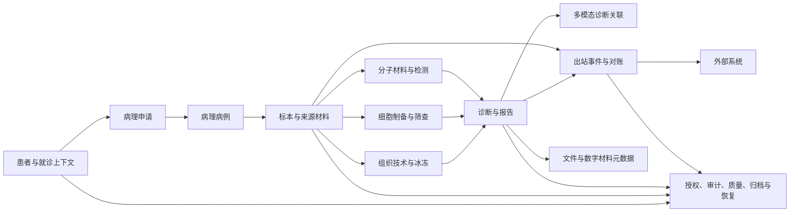
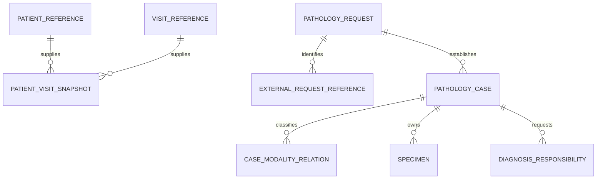
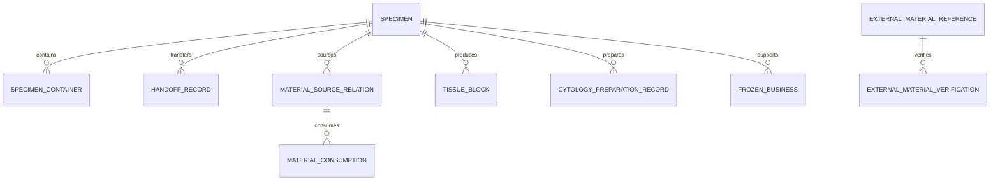
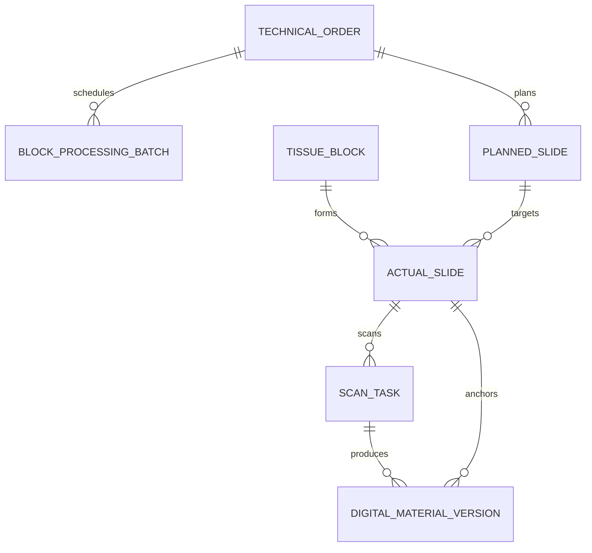
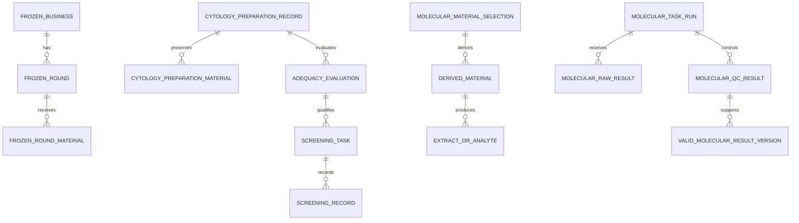
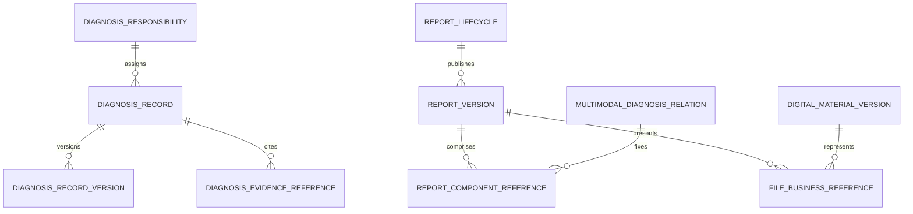
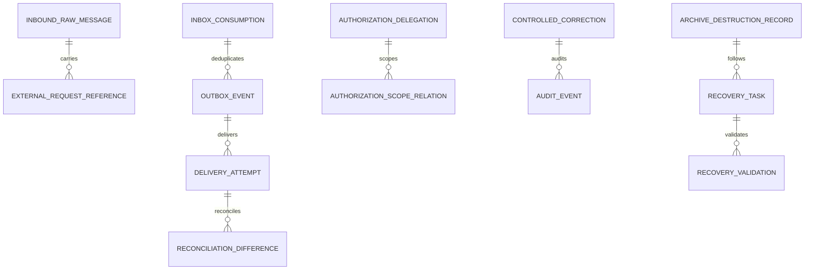

# P11 全病理逻辑ER模型

文档状态：已完成
数据库平台：待确认；本模型为产品中立逻辑模型
正式逻辑实体：89
正式关系：96

## 1. 全局高层ER关系图

图中只表达业务实体和责任边界，不表达数据库产品、API或页面。

## 2. 分领域ER图

### 2.1 患者上下文、申请和病例

申请与病例保持分离；患者和就诊只作为外部上下文引用及业务时点快照。

### 2.2 标本、容器、交接和材料来源

蜡块不是所有标本必经；实际玻片可以来自蜡块、细胞学标本、细胞学制备物或合法外部材料。

### 2.3 组织技术和实际玻片

计划玻片不等于实际玻片；扫描是可选能力；重扫和重传分别形成尝试与文件版本事实。

### 2.4 冰冻、细胞和分子

直接涂片只有制备记录，只有需要保存、复用、转移或作为后续来源时才形成稳定制备物。

### 2.5 诊断、报告、文件和数字材料

报告生命周期、报告版本、PDF文件和外部回传状态分离；综合报告固定引用组成版本，不覆盖组成报告。

### 2.6 集成、治理、归档和恢复

本地业务事实、原始入站消息、发件箱、投递尝试、外部状态和对账差异分别保存；不存在跨外部系统分布式事务。

## 3. 逻辑实体目录

每个P11-TBL对应一个有明确责任边界的逻辑实体P11-ENT。实体目录不代表每个P05对象必须独立成表；P11对象分类文件说明了嵌入、合并和关系边界。

| 实体 | 表 | 逻辑名称 | 中文名称 | 主责任模块 | 类别 | 主要聚合 |
|---|---|---|---|---|---|---|
| P11-ENT-001 | P11-TBL-001 | pathology_request | 病理申请 | P10-MOD-001 | 聚合根 | P05-AGG-001 |
| P11-ENT-002 | P11-TBL-002 | pathology_case | 病理病例 | P10-MOD-001 | 聚合根 | P05-AGG-002 |
| P11-ENT-003 | P11-TBL-003 | specimen | 标本 | P10-MOD-002 | 聚合根 | P05-AGG-003 |
| P11-ENT-004 | P11-TBL-004 | tissue_block | 蜡块业务记录 | P10-MOD-003 | 聚合根 | P05-AGG-004 |
| P11-ENT-005 | P11-TBL-005 | actual_slide | 实际玻片 | P10-MOD-003 | 聚合根 | P05-AGG-005 |
| P11-ENT-006 | P11-TBL-006 | digital_material | 数字材料聚合 | P10-MOD-010 | 聚合根 | P05-AGG-006 |
| P11-ENT-007 | P11-TBL-007 | technical_order | 技术医嘱 | P10-MOD-003 | 聚合根 | P05-AGG-007 |
| P11-ENT-008 | P11-TBL-008 | frozen_business | 术中冰冻业务 | P10-MOD-004 | 聚合根 | P05-AGG-008 |
| P11-ENT-009 | P11-TBL-009 | diagnosis_responsibility | 诊断责任 | P10-MOD-008 | 聚合根 | P05-AGG-009 |
| P11-ENT-010 | P11-TBL-010 | diagnosis_record | 诊断记录 | P10-MOD-008 | 聚合根 | P05-AGG-010 |
| P11-ENT-011 | P11-TBL-011 | report_lifecycle | 报告生命周期 | P10-MOD-008 | 聚合根 | P05-AGG-011 |
| P11-ENT-012 | P11-TBL-012 | outbound_business_event | 出站业务事件边界 | P10-MOD-011 | 聚合根 | P05-AGG-012 |
| P11-ENT-013 | P11-TBL-013 | cytology_material | 细胞学制备与材料 | P10-MOD-005 | 聚合根 | P05-AGG-013 |
| P11-ENT-014 | P11-TBL-014 | cytology_review_responsibility | 细胞筛查复核责任 | P10-MOD-005 | 聚合根 | P05-AGG-014 |
| P11-ENT-015 | P11-TBL-015 | molecular_task_run | 分子检测任务与运行 | P10-MOD-006 | 聚合根 | P05-AGG-015 |
| P11-ENT-016 | P11-TBL-016 | molecular_material_analyte | 分子材料与分析物 | P10-MOD-006 | 聚合根 | P05-AGG-016 |
| P11-ENT-017 | P11-TBL-017 | referral_external_result | 外送与外部结果 | P10-MOD-007 | 聚合根 | P05-AGG-017 |
| P11-ENT-018 | P11-TBL-018 | multimodal_diagnosis_relation | 多模态诊断关联 | P10-MOD-009 | 聚合根 | P05-AGG-018 |
| P11-ENT-019 | P11-TBL-019 | specimen_container | 标本容器 | P10-MOD-002 | 子实体 | P05-AGG-003 |
| P11-ENT-020 | P11-TBL-020 | tissue_box_identity | 组织盒身份 | P10-MOD-003 | 子实体 | P05-AGG-004 |
| P11-ENT-021 | P11-TBL-021 | block_processing_batch | 组织处理批次 | P10-MOD-003 | 子实体 | P05-AGG-004/007 |
| P11-ENT-022 | P11-TBL-022 | technical_execution | 技术执行记录 | P10-MOD-003 | 子实体 | P05-AGG-007 |
| P11-ENT-023 | P11-TBL-023 | planned_slide | 计划玻片 | P10-MOD-003 | 子实体 | P05-AGG-005/007 |
| P11-ENT-024 | P11-TBL-024 | scan_task | 扫描任务 | P10-MOD-010 | 子实体 | P05-AGG-006 |
| P11-ENT-025 | P11-TBL-025 | frozen_round | 冰冻轮次 | P10-MOD-004 | 子实体 | P05-AGG-008 |
| P11-ENT-026 | P11-TBL-026 | frozen_round_material | 冰冻轮次材料 | P10-MOD-004 | 子实体 | P05-AGG-008 |
| P11-ENT-027 | P11-TBL-027 | cytology_preparation_record | 细胞制备记录 | P10-MOD-005 | 子实体 | P05-AGG-013 |
| P11-ENT-028 | P11-TBL-028 | cytology_preparation_material | 细胞制备物 | P10-MOD-005 | 条件性子实体 | P05-AGG-013/016 |
| P11-ENT-029 | P11-TBL-029 | adequacy_evaluation | 充分性评价 | P10-MOD-005 | 子实体 | P05-AGG-013/014 |
| P11-ENT-030 | P11-TBL-030 | screening_task | 筛查任务 | P10-MOD-005 | 子实体 | P05-AGG-014 |
| P11-ENT-031 | P11-TBL-031 | screening_record | 筛查记录 | P10-MOD-005 | 子实体 | P05-AGG-014 |
| P11-ENT-032 | P11-TBL-032 | review_task | 复核任务 | P10-MOD-005 | 子实体 | P05-AGG-014 |
| P11-ENT-033 | P11-TBL-033 | review_record | 复核记录 | P10-MOD-005 | 子实体 | P05-AGG-014 |
| P11-ENT-034 | P11-TBL-034 | device_task | 设备任务 | P10-MOD-003 | 子实体 | P05-AGG-007 |
| P11-ENT-035 | P11-TBL-035 | device_run_batch | 设备运行批次 | P10-MOD-003/006 | 子实体 | P05-AGG-007/015 |
| P11-ENT-036 | P11-TBL-036 | molecular_raw_result | 分子设备原始结果 | P10-MOD-006 | 子实体 | P05-AGG-015 |
| P11-ENT-037 | P11-TBL-037 | molecular_qc_result | 分子质控结果 | P10-MOD-006 | 子实体 | P05-AGG-015 |
| P11-ENT-038 | P11-TBL-038 | molecular_material_selection | 检测材料选择 | P10-MOD-006 | 子实体 | P05-AGG-016 |
| P11-ENT-039 | P11-TBL-039 | extract_or_analyte | 提取物或分析物 | P10-MOD-006 | 子实体 | P05-AGG-016 |
| P11-ENT-040 | P11-TBL-040 | report_template | 报告模板版本 | P10-MOD-015 | 配置/版本 | P05-AGG-011 |
| P11-ENT-041 | P11-TBL-041 | case_modality_participation | 病例模态参与项 | P10-MOD-001/009 | 关系子实体 | P05-AGG-002/018 |
| P11-ENT-042 | P11-TBL-042 | technical_target | 技术目标 | P10-MOD-003 | 子实体 | P05-AGG-007 |
| P11-ENT-043 | P11-TBL-043 | operation_responsibility | 操作责任事实 | P10-MOD-013 | 不可变事实 | 治理边界 |
| P11-ENT-044 | P11-TBL-044 | handoff_record | 交接事实 | P10-MOD-013 | 不可变事实 | 关联聚合 |
| P11-ENT-045 | P11-TBL-045 | material_derivation | 材料派生事实 | P10-MOD-006 | 不可变事实 | P05-AGG-016 |
| P11-ENT-046 | P11-TBL-046 | material_consumption | 材料消耗事实 | P10-MOD-006 | 不可变事实 | P05-AGG-016 |
| P11-ENT-047 | P11-TBL-047 | business_exception | 业务异常事实 | P10-MOD-012 | 不可变事实 | 治理边界 |
| P11-ENT-048 | P11-TBL-048 | quality_event | 质量事件 | P10-MOD-012 | 不可变事实 | 治理边界 |
| P11-ENT-049 | P11-TBL-049 | controlled_correction | 受控纠错事实 | P10-MOD-012 | 不可变事实 | 治理边界 |
| P11-ENT-050 | P11-TBL-050 | authorization_delegation | 授权代理事实 | P10-MOD-013 | 不可变事实 | 治理边界 |
| P11-ENT-051 | P11-TBL-051 | audit_event | 审计事件 | P10-MOD-013 | 不可变事实 | 治理边界 |
| P11-ENT-052 | P11-TBL-052 | archive_destruction_record | 档案销毁事实 | P10-MOD-014 | 不可变事实 | 治理边界 |
| P11-ENT-053 | P11-TBL-053 | recovery_task | 恢复任务 | P10-MOD-014 | 不可变事实 | 治理边界 |
| P11-ENT-054 | P11-TBL-054 | recovery_validation | 恢复校验事实 | P10-MOD-014 | 不可变事实 | 治理边界 |
| P11-ENT-055 | P11-TBL-055 | external_material_verification | 外部材料核验 | P10-MOD-007 | 不可变事实 | P05-AGG-017 |
| P11-ENT-056 | P11-TBL-056 | diagnosis_record_version | 诊断记录版本 | P10-MOD-008 | 不可变版本 | P05-AGG-010 |
| P11-ENT-057 | P11-TBL-057 | report_version | 报告版本 | P10-MOD-008 | 不可变版本 | P05-AGG-011 |
| P11-ENT-058 | P11-TBL-058 | report_component_reference | 报告组成引用 | P10-MOD-008/009 | 不可变版本 | P05-AGG-011/018 |
| P11-ENT-059 | P11-TBL-059 | valid_molecular_result_version | 有效分子结果版本 | P10-MOD-006 | 不可变版本 | P05-AGG-015 |
| P11-ENT-060 | P11-TBL-060 | molecular_interpretation_version | 分子医学判读版本 | P10-MOD-006 | 不可变版本 | P05-AGG-015 |
| P11-ENT-061 | P11-TBL-061 | external_result_version | 外部结果版本 | P10-MOD-007 | 不可变版本 | P05-AGG-017 |
| P11-ENT-062 | P11-TBL-062 | digital_material_version | 数字材料版本 | P10-MOD-010 | 不可变版本 | P05-AGG-006 |
| P11-ENT-063 | P11-TBL-063 | pdf_file_version | PDF文件版本 | P10-MOD-015 | 不可变版本 | P05-AGG-011 |
| P11-ENT-064 | P11-TBL-064 | clinical_state_current | 临床对象当前状态 | 各拥有模块 | 当前状态 | 对应P08状态机 |
| P11-ENT-065 | P11-TBL-065 | material_state_current | 材料对象当前状态 | P10-MOD-002/003/005/006/007 | 当前状态 | 对应P08状态机 |
| P11-ENT-066 | P11-TBL-066 | task_state_current | 任务对象当前状态 | 各拥有模块 | 当前状态 | 对应P08状态机 |
| P11-ENT-067 | P11-TBL-067 | report_state_current | 报告对象当前状态 | P10-MOD-008 | 当前状态 | 对应P08状态机 |
| P11-ENT-068 | P11-TBL-068 | integration_state_current | 集成对象当前状态 | P10-MOD-011 | 当前状态 | 对应P08状态机 |
| P11-ENT-069 | P11-TBL-069 | governance_state_current | 治理对象当前状态 | P10-MOD-012/013/014 | 当前状态 | 对应P08状态机 |
| P11-ENT-070 | P11-TBL-070 | state_transition_history | 状态转换历史 | 各拥有模块 | 历史表 | 31个状态机共用审计能力 |
| P11-ENT-071 | P11-TBL-071 | patient_context_reference | 患者上下文引用 | P10-MOD-001 | 外部引用 | 上下文边界 |
| P11-ENT-072 | P11-TBL-072 | visit_context_reference | 就诊上下文引用 | P10-MOD-001 | 外部引用 | 上下文边界 |
| P11-ENT-073 | P11-TBL-073 | patient_visit_snapshot | 患者就诊快照 | P10-MOD-001/008 | 快照表 | P05-AGG-002/011 |
| P11-ENT-074 | P11-TBL-074 | external_request_reference | 外部申请引用 | P10-MOD-001 | 外部引用 | P05-AGG-001 |
| P11-ENT-075 | P11-TBL-075 | external_material_reference | 外部材料引用 | P10-MOD-002/007/010 | 外部引用 | 关联聚合 |
| P11-ENT-076 | P11-TBL-076 | diagnosis_evidence_reference | 诊断依据引用 | P10-MOD-008 | 关系表 | P05-AGG-010 |
| P11-ENT-077 | P11-TBL-077 | case_modality_relation | 病例模态关系 | P10-MOD-001/009 | 关系表 | P05-AGG-002/018 |
| P11-ENT-078 | P11-TBL-078 | material_source_relation | 材料来源关系 | 各材料拥有模块 | 关系表 | 来源链 |
| P11-ENT-079 | P11-TBL-079 | authorization_scope_relation | 授权范围关系 | P10-MOD-013 | 关系表 | 治理边界 |
| P11-ENT-080 | P11-TBL-080 | external_system_configuration | 外部系统配置 | P10-MOD-015/011 | 配置表 | P10-MOD-015 |
| P11-ENT-081 | P11-TBL-081 | code_set_definition | 受控代码集定义 | P10-MOD-015 | 配置表 | 配置边界 |
| P11-ENT-082 | P11-TBL-082 | business_file | 业务文件元数据 | 文件能力 | 文件元数据 | P10-MOD-004/008/010/014 |
| P11-ENT-083 | P11-TBL-083 | file_integrity_check | 文件完整性校验 | 文件能力 | 文件事实 | 文件能力 |
| P11-ENT-084 | P11-TBL-084 | file_business_reference | 文件业务引用 | 文件能力 | 关系表 | 业务引用 |
| P11-ENT-085 | P11-TBL-085 | inbound_raw_message | 入站原始消息 | P10-MOD-003 | 事件表 | P05-AGG-001/012 |
| P11-ENT-086 | P11-TBL-086 | outbox_event | 事件发件箱 | P10-MOD-011 | 事件表 | P05-AGG-012 |
| P11-ENT-087 | P11-TBL-087 | inbox_consumption | 事件收件箱去重 | P10-MOD-011 | 事件表 | P05-AGG-012 |
| P11-ENT-088 | P11-TBL-088 | delivery_attempt | 单次投递尝试 | P10-MOD-011 | 事件事实 | P05-AGG-012 |
| P11-ENT-089 | P11-TBL-089 | reconciliation_difference | 对账差异 | P10-MOD-011 | 事件事实 | P05-AGG-012 |

## 4. 关系目录

关系的删除规则默认是RESTRICT、NO ACTION或等价的产品中立禁止删除语义；历史事实不因上游对象状态变化而删除。跨模块关系只有在核心身份链和即时一致确有必要时才使用数据库外键，其他关系使用逻辑引用、快照或事件投影。

| 关系 | 源实体 | 目标实体 | 基数/必选 | 语义与所有权 | 外键/删除 | 主要不变量 |
|---|---|---|---|---|---|---|
| P11-REL-001 | P11-ENT-071 | P11-ENT-073 | 1:N/是 | 患者引用提供快照来源 | FK/禁止删除 | P05-INV-001/006 |
| P11-REL-002 | P11-ENT-072 | P11-ENT-073 | 1:N/是 | 就诊引用提供快照来源 | FK/禁止删除 | P05-INV-006 |
| P11-REL-003 | P11-ENT-001 | P11-ENT-074 | 1:N/是 | 申请拥有外部申请标识 | FK/禁止删除 | P05-INV-037/038 |
| P11-REL-004 | P11-ENT-001 | P11-ENT-002 | 1:N/否 | 申请建立病例但不拥有病例医学事实 | FK/禁止删除 | P05-INV-001/002 |
| P11-REL-005 | P11-ENT-002 | P11-ENT-073 | 1:N/是 | 病例固定上下文快照 | FK/禁止删除 | P05-INV-006/008 |
| P11-REL-006 | P11-ENT-002 | P11-ENT-077 | 1:N/否 | 病例参与多个病理模态 | FK/禁止删除 | P05-INV-062/069 |
| P11-REL-007 | P11-ENT-002 | P11-ENT-003 | 1:N/是 | 病例承载多个标本 | FK/禁止删除 | P05-INV-009/010 |
| P11-REL-008 | P11-ENT-002 | P11-ENT-047 | 1:N/否 | 病例异常影响记录 | 逻辑引用/禁止删除 | P05-INV-040 |
| P11-REL-009 | P11-ENT-003 | P11-ENT-019 | 1:N/否 | 标本可有容器追踪 | FK/禁止删除 | P05-INV-009/014 |
| P11-REL-010 | P11-ENT-003 | P11-ENT-044 | 1:N/是 | 标本责任交接事实 | FK/禁止删除 | P05-INV-019/023 |
| P11-REL-011 | P11-ENT-003 | P11-ENT-075 | 1:N/否 | 标本外部材料引用 | 逻辑引用/禁止删除 | P05-INV-001/014 |
| P11-REL-012 | P11-ENT-003 | P11-ENT-004 | 1:N/否 | 标本可进入蜡块路径 | FK/禁止删除 | P05-INV-004 |
| P11-REL-013 | P11-ENT-003 | P11-ENT-027 | 1:N/否 | 标本进入细胞制备 | FK/禁止删除 | P05-INV-050/055 |
| P11-REL-014 | P11-ENT-003 | P11-ENT-008 | 1:N/否 | 标本进入冰冻业务 | FK/禁止删除 | P05-INV-034 |
| P11-REL-015 | P11-ENT-078 | P11-ENT-046 | 1:N/否 | 材料来源和消耗事实 | FK/禁止删除 | P05-INV-063/064 |
| P11-REL-016 | P11-ENT-078 | P11-ENT-045 | 1:N/否 | 来源材料派生链 | FK/禁止删除 | P05-INV-004/063 |
| P11-REL-017 | P11-ENT-007 | P11-ENT-021 | 1:N/否 | 技术医嘱安排处理批次 | FK/禁止删除 | P05-INV-017 |
| P11-REL-018 | P11-ENT-007 | P11-ENT-023 | 1:N/否 | 技术医嘱产生计划目标 | FK/禁止删除 | P05-INV-015/016 |
| P11-REL-019 | P11-ENT-004 | P11-ENT-005 | 1:N/否 | 蜡块形成实际玻片 | FK/禁止删除 | P05-INV-004/005 |
| P11-REL-020 | P11-ENT-023 | P11-ENT-005 | 1:N/否 | 计划目标关联实际玻片 | 逻辑引用/禁止删除 | P05-INV-015/016 |
| P11-REL-021 | P11-ENT-005 | P11-ENT-024 | 1:N/否 | 实际玻片可发起扫描 | FK/禁止删除 | P05-INV-013 |
| P11-REL-022 | P11-ENT-024 | P11-ENT-062 | 1:N/否 | 扫描任务形成数字版本 | FK/禁止删除 | P05-INV-013/025 |
| P11-REL-023 | P11-ENT-005 | P11-ENT-062 | 1:N/否 | 数字版本固定实际玻片来源 | FK/禁止删除 | P05-INV-005/013 |
| P11-REL-024 | P11-ENT-034 | P11-ENT-022 | 1:N/否 | 设备任务关联技术执行 | FK/禁止删除 | P05-INV-017/020 |
| P11-REL-025 | P11-ENT-008 | P11-ENT-025 | 1:N/是 | 冰冻业务拥有多个轮次 | FK/禁止删除 | P05-INV-034/035 |
| P11-REL-026 | P11-ENT-025 | P11-ENT-026 | 1:N/是 | 轮次拥有材料记录 | FK/禁止删除 | P05-INV-036 |
| P11-REL-027 | P11-ENT-026 | P11-ENT-003 | N:1/是 | 轮次材料来源于标本 | FK/禁止删除 | P05-INV-014 |
| P11-REL-028 | P11-ENT-008 | P11-ENT-010 | 1:N/否 | 冰冻意见进入诊断证据 | 逻辑引用/禁止删除 | P05-INV-034/069 |
| P11-REL-029 | P11-ENT-008 | P11-ENT-004 | 1:N/否 | 冰剩可转常规蜡块 | 逻辑引用/禁止删除 | P05-INV-004/036 |
| P11-REL-030 | P11-ENT-026 | P11-ENT-045 | 1:N/否 | 冰冻材料形成派生材料 | FK/禁止删除 | P05-INV-004/036 |
| P11-REL-031 | P11-ENT-008 | P11-ENT-011 | 1:N/否 | 冰冻报告版本关系 | 逻辑引用/禁止删除 | P05-INV-028/034 |
| P11-REL-032 | P11-ENT-048 | P11-ENT-047 | 1:N/否 | 冰冻差异可形成质量/异常事实 | 逻辑引用/禁止删除 | P05-INV-035/040 |
| P11-REL-033 | P11-ENT-027 | P11-ENT-028 | 1:N/否 | 制备记录可产生稳定制备物 | FK/禁止删除 | P05-INV-055 |
| P11-REL-034 | P11-ENT-027 | P11-ENT-005 | 1:N/否 | 制备记录可直接形成实际玻片 | FK/禁止删除 | P05-INV-004/055 |
| P11-REL-035 | P11-ENT-028 | P11-ENT-005 | 1:N/否 | 稳定制备物可形成玻片 | FK/禁止删除 | P05-INV-004/064 |
| P11-REL-036 | P11-ENT-028 | P11-ENT-046 | 1:N/否 | 制备物消耗追加记录 | FK/禁止删除 | P05-INV-063/064 |
| P11-REL-037 | P11-ENT-003 | P11-ENT-029 | 1:N/否 | 标本或制备物充分性评价 | FK/禁止删除 | P05-INV-054/059 |
| P11-REL-038 | P11-ENT-029 | P11-ENT-030 | 1:N/否 | 充分性决定筛查资格 | 事务守卫/禁止删除 | P05-INV-059/061 |
| P11-REL-039 | P11-ENT-030 | P11-ENT-031 | 1:N/是 | 筛查任务产生筛查记录 | FK/禁止删除 | P05-INV-060 |
| P11-REL-040 | P11-ENT-032 | P11-ENT-033 | 1:N/是 | 复核任务产生复核记录 | FK/禁止删除 | P05-INV-060/061 |
| P11-REL-041 | P11-ENT-002 | P11-ENT-015 | 1:N/否 | 病例建立分子检测任务 | 逻辑引用/禁止删除 | P05-INV-062/066 |
| P11-REL-042 | P11-ENT-038 | P11-ENT-045 | 1:N/否 | 材料选择形成派生材料 | FK/禁止删除 | P05-INV-063/064 |
| P11-REL-043 | P11-ENT-045 | P11-ENT-039 | 1:N/否 | 派生材料形成分析物 | FK/禁止删除 | P05-INV-063/065 |
| P11-REL-044 | P11-ENT-039 | P11-ENT-015 | N:1/是 | 分析物用于检测任务 | FK/禁止删除 | P05-INV-066 |
| P11-REL-045 | P11-ENT-015 | P11-ENT-035 | 1:N/是 | 检测任务关联运行批次 | FK/禁止删除 | P05-INV-066/067 |
| P11-REL-046 | P11-ENT-015 | P11-ENT-036 | 1:N/是 | 运行接收原始结果 | FK/禁止删除 | P05-INV-066 |
| P11-REL-047 | P11-ENT-015 | P11-ENT-037 | 1:N/是 | 运行产生质控结果 | FK/禁止删除 | P05-INV-067/068 |
| P11-REL-048 | P11-ENT-037 | P11-ENT-059 | 1:N/否 | 质控支持有效结果 | 事务守卫/禁止删除 | P05-INV-066/067/068 |
| P11-REL-049 | P11-ENT-002 | P11-ENT-017 | 1:N/否 | 病例可建立外送检测 | 逻辑引用/禁止删除 | P05-INV-069/070 |
| P11-REL-050 | P11-ENT-017 | P11-ENT-044 | 1:N/是 | 外送任务记录交接 | FK/禁止删除 | P05-INV-023/069 |
| P11-REL-051 | P11-ENT-017 | P11-ENT-061 | 1:N/否 | 外送任务接收外部结果 | FK/禁止删除 | P05-INV-069/070 |
| P11-REL-052 | P11-ENT-061 | P11-ENT-055 | 1:N/是 | 外部结果必须经过本地核验 | FK/禁止删除 | P05-INV-069/070 |
| P11-REL-053 | P11-ENT-061 | P11-ENT-082 | 1:N/否 | 外部结果引用外部报告文件 | 逻辑引用/禁止删除 | P05-INV-025/069 |
| P11-REL-054 | P11-ENT-017 | P11-ENT-045 | 1:N/否 | 外送剩余材料处理 | 逻辑引用/禁止删除 | P05-INV-063/069 |
| P11-REL-055 | P11-ENT-075 | P11-ENT-055 | 1:N/否 | 外部材料引用核验记录 | FK/禁止删除 | P05-INV-014/069 |
| P11-REL-056 | P11-ENT-055 | P11-ENT-076 | 1:N/否 | 核验通过后可作为诊断依据 | 事务守卫/禁止删除 | P05-INV-069/070 |
| P11-REL-057 | P11-ENT-009 | P11-ENT-010 | 1:N/是 | 诊断责任产生诊断记录 | FK/禁止删除 | P05-INV-019/024 |
| P11-REL-058 | P11-ENT-010 | P11-ENT-056 | 1:N/是 | 诊断记录形成不可变版本 | FK/禁止删除 | P05-INV-024/025 |
| P11-REL-059 | P11-ENT-010 | P11-ENT-076 | 1:N/是 | 诊断记录引用医学依据 | FK/禁止删除 | P05-INV-024/027 |
| P11-REL-060 | P11-ENT-011 | P11-ENT-057 | 1:N/是 | 报告生命周期拥有报告版本 | FK/禁止删除 | P05-INV-028/030 |
| P11-REL-061 | P11-ENT-057 | P11-ENT-058 | 1:N/否 | 报告版本固定组成引用 | FK/禁止删除 | P05-INV-031/032 |
| P11-REL-062 | P11-ENT-057 | P11-ENT-084 | 1:N/否 | 报告版本引用PDF或附件 | FK/禁止删除 | P05-INV-028/032 |
| P11-REL-063 | P11-ENT-018 | P11-ENT-058 | 1:N/是 | 综合关联固定组成版本 | 事务守卫/禁止删除 | P05-INV-069/070 |
| P11-REL-064 | P11-ENT-057 | P11-ENT-086 | 1:N/否 | 报告版本形成出站事件 | 逻辑引用/禁止删除 | P05-INV-032/037 |
| P11-REL-065 | P11-ENT-082 | P11-ENT-063 | 1:N/否 | 文件可产生不可变文件版本 | FK/禁止删除 | P05-INV-025/032 |
| P11-REL-066 | P11-ENT-082 | P11-ENT-083 | 1:N/是 | 文件完整性校验 | FK/禁止删除 | P05-INV-025/047 |
| P11-REL-067 | P11-ENT-082 | P11-ENT-084 | 1:N/否 | 文件与业务对象关系 | FK/禁止删除 | P05-INV-025/032 |
| P11-REL-068 | P11-ENT-062 | P11-ENT-084 | 1:N/否 | 数字版本引用文件 | FK/禁止删除 | P05-INV-013/025 |
| P11-REL-069 | P11-ENT-040 | P11-ENT-082 | 1:N/否 | 模板版本引用文件 | FK/禁止删除 | P05-INV-028/032 |
| P11-REL-070 | P11-ENT-053 | P11-ENT-083 | 1:N/否 | 恢复任务引用文件校验 | FK/禁止删除 | P05-INV-047/048 |
| P11-REL-071 | P11-ENT-052 | P11-ENT-082 | 1:N/否 | 销毁记录引用业务文件 | 逻辑引用/禁止删除 | P05-INV-045/047 |
| P11-REL-072 | P11-ENT-082 | P11-ENT-069 | 1:N/否 | 文件归档和销毁状态 | 事务守卫/禁止删除 | P05-INV-045/047 |
| P11-REL-073 | P11-ENT-043 | P11-ENT-051 | 1:N/是 | 操作责任形成审计 | FK/禁止删除 | P05-INV-041/044 |
| P11-REL-074 | P11-ENT-044 | P11-ENT-043 | N:1/是 | 交接必须有责任事实 | FK/禁止删除 | P05-INV-019/023 |
| P11-REL-075 | P11-ENT-050 | P11-ENT-079 | 1:N/是 | 授权拥有范围 | FK/禁止删除 | P05-INV-041/043 |
| P11-REL-076 | P11-ENT-049 | P11-ENT-051 | 1:N/是 | 纠错形成审计证据 | FK/禁止删除 | P05-INV-026/030/044 |
| P11-REL-077 | P11-ENT-048 | P11-ENT-047 | 1:N/否 | 质量事件可关联异常 | 逻辑引用/禁止删除 | P05-INV-040/043 |
| P11-REL-078 | P11-ENT-047 | P11-ENT-070 | 1:N/否 | 异常影响状态历史 | 逻辑引用/禁止删除 | P05-INV-040 |
| P11-REL-079 | P11-ENT-052 | P11-ENT-069 | 1:N/是 | 销毁任务受治理状态保护 | FK/禁止删除 | P05-INV-045/047 |
| P11-REL-080 | P11-ENT-053 | P11-ENT-054 | 1:N/是 | 恢复任务拥有校验结果 | FK/禁止删除 | P05-INV-047/048 |
| P11-REL-081 | P11-ENT-085 | P11-ENT-074 | 1:N/否 | 原始消息承载外部申请标识 | 逻辑引用/禁止删除 | P05-INV-037/038 |
| P11-REL-082 | P11-ENT-085 | P11-ENT-001 | 1:N/否 | 原始消息关联本地申请 | 事务守卫/禁止删除 | P05-INV-001/037 |
| P11-REL-083 | P11-ENT-086 | P11-ENT-088 | 1:N/是 | 发件箱产生投递尝试 | FK/禁止删除 | P05-INV-037/039 |
| P11-REL-084 | P11-ENT-087 | P11-ENT-086 | N:1/是 | 收件箱按事件和消费者去重 | 逻辑引用/禁止删除 | P05-INV-037/039 |
| P11-REL-085 | P11-ENT-088 | P11-ENT-080 | N:1/是 | 投递尝试指向外部目标 | FK/禁止删除 | P05-INV-037/038 |
| P11-REL-086 | P11-ENT-088 | P11-ENT-089 | 1:N/否 | 投递结果进入对账 | 逻辑引用/禁止删除 | P05-INV-039/040 |
| P11-REL-087 | P11-ENT-089 | P11-ENT-051 | 1:N/否 | 对账处置形成审计 | FK/禁止删除 | P05-INV-040/044 |
| P11-REL-088 | P11-ENT-080 | P11-ENT-086 | 1:N/否 | 外部目标约束出站路由 | FK/禁止删除 | P05-INV-037/038 |
| P11-REL-089 | P11-ENT-064 | P11-ENT-070 | 1:N/是 | 临床当前状态产生转换历史 | FK/禁止删除 | P05-INV-002/009/028 |
| P11-REL-090 | P11-ENT-065 | P11-ENT-070 | 1:N/是 | 材料当前状态产生转换历史 | FK/禁止删除 | P05-INV-004/005/063 |
| P11-REL-091 | P11-ENT-066 | P11-ENT-070 | 1:N/是 | 任务当前状态产生转换历史 | FK/禁止删除 | P05-INV-017/059/066 |
| P11-REL-092 | P11-ENT-067 | P11-ENT-070 | 1:N/是 | 报告当前状态产生转换历史 | FK/禁止删除 | P05-INV-028/030 |
| P11-REL-093 | P11-ENT-068 | P11-ENT-070 | 1:N/是 | 集成当前状态产生转换历史 | FK/禁止删除 | P05-INV-037/039 |
| P11-REL-094 | P11-ENT-069 | P11-ENT-070 | 1:N/是 | 治理当前状态产生转换历史 | FK/禁止删除 | P05-INV-040/047 |
| P11-REL-095 | P11-ENT-070 | P11-ENT-047 | 1:N/否 | 状态转换关联异常 | 逻辑引用/禁止删除 | P05-INV-040 |
| P11-REL-096 | P11-ENT-070 | P11-ENT-049 | 1:N/否 | 状态转换关联纠错或授权 | 逻辑引用/禁止删除 | P05-INV-026/041 |

## 5. ER模型结论

申请、病例、标本、材料、检测、诊断、报告和集成均保留独立业务边界；跨模块关系按P10事务策略分为即时外键、逻辑引用、快照和事件投影。不存在一个万能材料表、万能结果表或万能状态表；不存在跨外部系统分布式事务。
