# P08 跨对象转换规则与状态图

文档状态：P08 已设计

## 1. 跨对象守卫

1. 申请转病例：申请已建立、患者/就诊风险已处置、病理类型已确认；申请取消不删除病例已形成事实。
2. 病例转标本：病例身份和标本来源明确；多个标本分别接收和交接。
3. 标本转蜡块：仅组织或冰剩转常规材料可建立蜡块；细胞和分子路径不强制经过蜡块。
4. 标本/制备物转实际玻片：实际玻片来源可为蜡块、细胞学标本、细胞学制备物或外部材料；来源必须固定。
5. 实际玻片转数字切片：扫描是可选下游；扫描失败不阻断实体玻片直接诊断。
6. 细胞制备转充分性：充分性评价引用实际材料和制备记录，不虚构瞬时制备物。
7. 充分性转筛查：只有合格或授权让步材料可进入筛查；不充分只阻断受影响路径。
8. 技术医嘱转执行：授权、目标身份和责任齐全；计划玻片不等于实际玻片。
9. 分子任务转运行：材料选择、消耗和提取事实完整；独立病例和附属检测关系分开。
10. 运行转有效结果：原始结果和质控先固定；质控失败按实际影响范围阻断。
11. 有效结果转判读：只有授权确认的有效结果可进入医学判读；复测建立新任务或新运行。
12. 诊断责任转诊断记录：责任接管后提交医学意见；记录提交后只能追加。
13. 诊断记录转报告版本：材料引用、上下文快照、签发责任和模板版本齐全。
14. 报告版本转出站事件：本地签发事实先形成；投递和外部状态不回写报告版本。
15. 外送材料转外部结果：交接签收和外部标识完整；外部执行不伪装成本地运行。
16. 外部结果转综合诊断：患者、来源、完整性、资质和医学核验通过；外部原值仍保留。
17. 组成报告转综合报告：组织、细胞、分子和外部医学依据固定引用；综合报告是新版本。
18. 质量事件转隔离：质量风险只隔离影响对象和引用路径，未受影响对象继续。
19. 受控纠错转新事实：原值、理由、影响、批准和新值必须可追溯；禁止覆盖原值。
20. 恢复任务转生产重新开放：技术恢复、业务校验、销毁/冻结核对和授权放行全部通过。

## 2. 聚合协调表

| 上游聚合 | 下游聚合 | 传递对象 | 传递条件 | 责任交出方 | 责任接收方 | 是否签收 | 失败影响 | 异常入口 | 关联不变量 |
|---|---|---|---|---|---|---|---|---|---|
| AGG-001 | AGG-002 | 已建立申请和上下文快照 | 患者/就诊风险可用 | 申请接收人员 | 病例管理人员 | 是 | 未建案的申请路径 | P07-EXC-004 | INV-001/006 |
| AGG-002 | AGG-003 | 病例身份和标本预登记 | 来源和病理类型明确 | 病例管理人员 | 标本接收人员 | 是 | 受影响标本 | P07-EXC-007 | INV-009/010 |
| AGG-003 | AGG-004 | 组织来源和取材事实 | 标本已接收 | 标本责任人 | 取材人员 | 是 | 受影响蜡块 | P07-EXC-016 | INV-003/014 |
| AGG-004 | AGG-005 | 蜡块身份和切片来源 | 物理蜡块已形成 | 技术人员 | 制片人员 | 是 | 受影响玻片 | P07-EXC-022 | INV-004/005 |
| AGG-005 | AGG-006 | 实际玻片和扫描请求 | 扫描为可选且来源固定 | 制片人员 | 扫描人员 | 是 | 仅数字路径 | P07-EXC-025 | INV-013/017 |
| AGG-013 | AGG-014 | 实际制备材料和充分性结论 | 材料可用 | 细胞技术人员 | 筛查/复核人员 | 是 | 受影响细胞任务 | P07-EXC-055 | INV-055/059 |
| AGG-015 | AGG-011 | 有效结果和医学判读版本 | 质控及授权确认 | 分子责任人 | 诊断/签发人 | 是 | 受影响报告 | P07-EXC-079 | INV-066/070 |
| AGG-017 | AGG-018 | 已核验外部结果 | 来源和完整性可用 | 外送/核验人员 | 综合诊断人 | 是 | 外部依据不可用 | P07-EXC-085 | INV-063/069 |
| AGG-011 | AGG-012 | 正式报告版本 | 本地签发事实形成 | 签发人 | 出站责任边界 | 否，技术投递另行记录 | 仅投递路径 | P07-EXC-088 | INV-032/037 |
| 治理边界 | 任一受影响聚合 | 隔离、纠错、恢复或销毁事实 | 授权和证据完整 | 质量/恢复责任人 | 所属聚合责任人 | 按对象确认 | 受影响范围 | P07-EXC-103~108 | INV-040/047/048 |

## 3. Mermaid 状态图

### 1. 申请对象

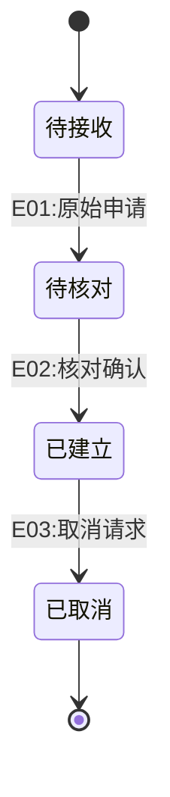

### 2. 病例对象

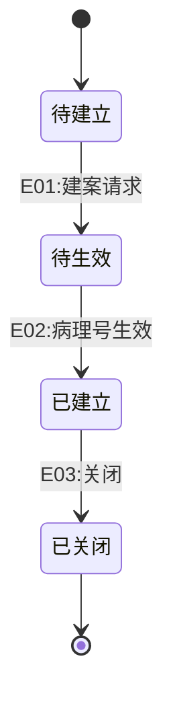

### 3. 标本对象

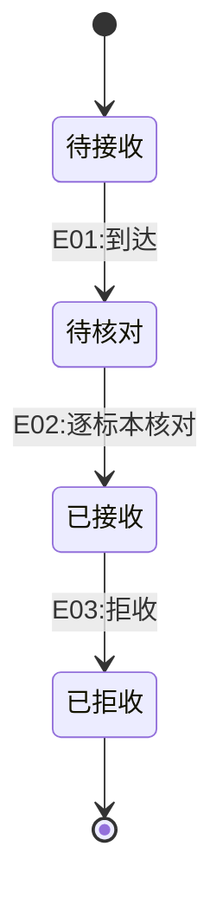

### 4. 蜡块对象

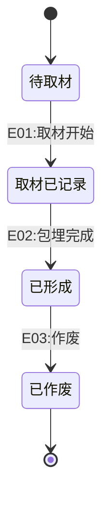

### 5. 实际玻片对象

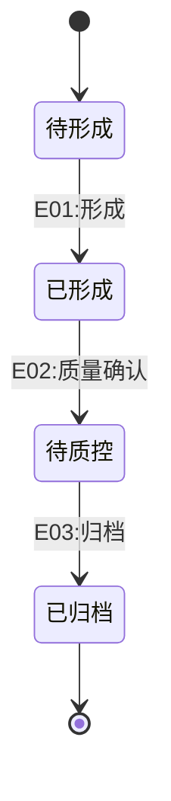

### 6. 数字切片对象

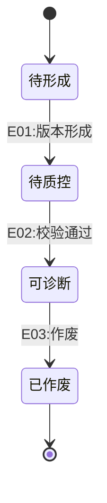

### 7. 细胞制备物对象

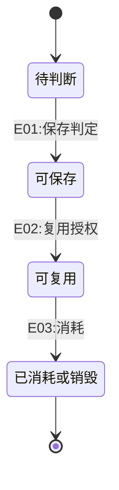

### 8. 细胞筛查任务对象

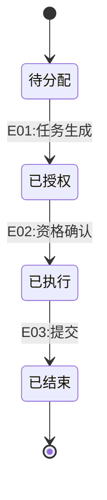

### 9. 技术医嘱对象

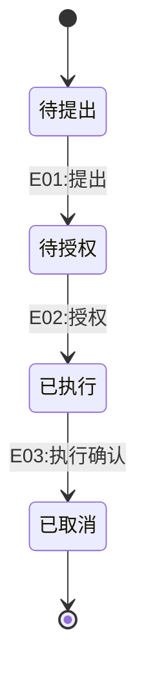

### 10. 分子检测任务对象

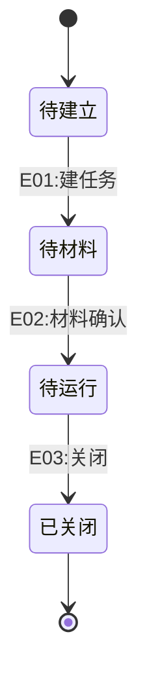

### 11. 分子检测运行对象

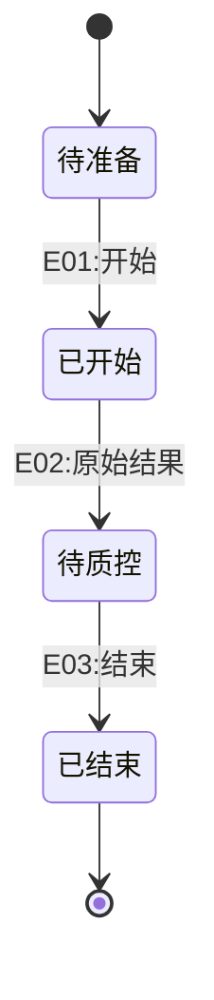

### 12. 结果验证对象

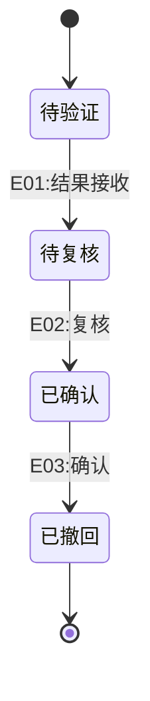

### 13. 诊断任务对象

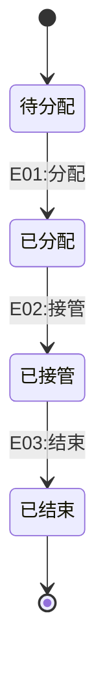

### 14. 诊断记录对象

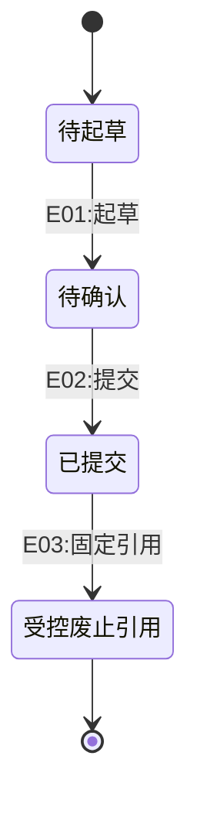

### 15. 报告生命周期对象

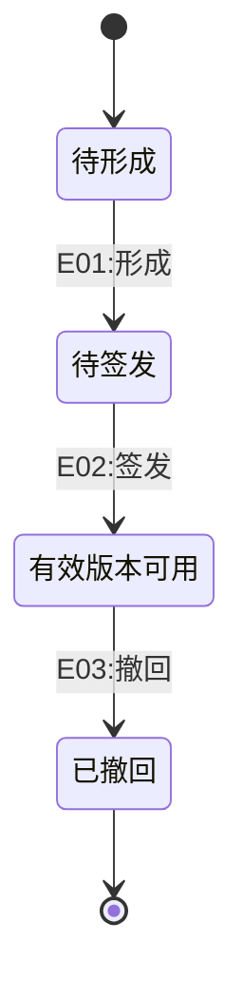

### 16. 报告版本对象

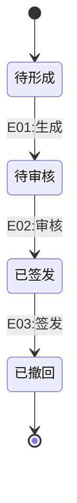

### 17. 出站事件对象

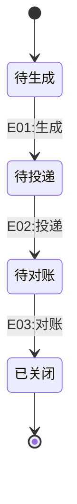

### 18. 质量事件对象

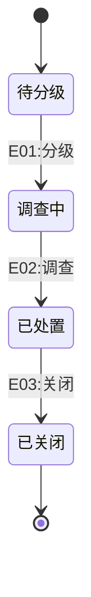

### 19. 受控纠错对象

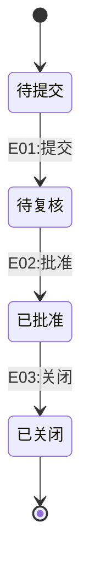

### 20. 恢复任务对象

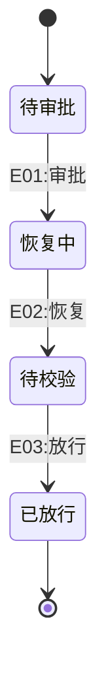

## 4. 跨对象禁止规则

- 禁止病例状态代替标本、蜡块、玻片、数字材料、任务、结果和报告版本状态。
- 禁止把“全部下游成功”作为无关对象进入终态的前置条件。
- 禁止用回滚删除已形成的物料、诊断、报告、投递或审计事实。
- 禁止将外部结果、设备原始结果、质控结果、有效结果和医学判读合并为一个状态。
- 禁止把医院配置值当作身份、来源、责任或历史保护规则。

## 5. 下阶段输入

P09 接收业务守卫和角色责任；P10 接收跨聚合一致性、重试、补偿和隔离边界；P11 接收稳定身份、版本和事实持久化需求；P12 接收出站事件、投递、外部标识和回执分层；P14 接收责任、代理、签发、撤回、销毁和恢复授权；P24 接收对象维度与任务节点展示；P25 接收每个转换的前置、守卫、异常、恢复和审计验证条件。
