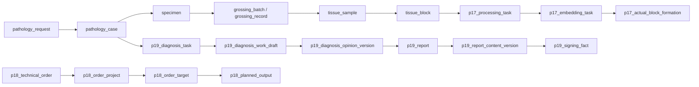

# PIS-Next V2 P00 当前系统审计

文档状态：已完成
文档版本：V2-0.2
审计日期：2026-08-08
审计基线：远程 `origin/main` 的 `e8abc9b` 加本轮文档提交
审计范围：`D:\Projects\pis-next` 当前 Git 工作区
审计原则：净室设计；未读取、未分析任何外部旧 PIS 材料

## 1. 审计结论

当前仓库已经不是空的文档骨架，而是一个阶段性可运行工程：

- 后端使用 Java 21、Spring Boot 4.1、Spring Modulith、JDBC、Flyway 和 PostgreSQL；
- 前端使用 Vue 3.5、Vite 8、TypeScript、Vitest 和 Node 24；
- 已有 P15 登记/标本接收、P16 取材/蜡块标签、P17 组织处理/包埋、P18 技术医嘱、P19 诊断/报告实现；
- 数据库已有 `pis` schema 和 Flyway V1–V9 迁移；
- 已有后端单元/集成/Web 测试、前端组件测试、Docker Compose、CI 和烟测脚本；
- 现有实现仍包含 V2 明确禁止或需要重构的核心语义：`ProcessingTask`、`EmbeddingTask`、`ActualBlockFormation`、计划输出模型、诊断 Task 作为工作主体，以及 Report 内容版本嵌套；
- 当前代码没有 `Slide`、`DigitalSlide`、FrozenRound、Assignment/ResponsibilityChain、BusinessType/ApplicationItemMapping 等完整 V2 核心实现；
- 因此 V2 不是在空仓库上开始，而是要在保留工程资产的前提下，对 P15–P19 领域实现做显式隔离、重构和迁移治理。

本审计不把既有测试通过、P15–P19 文档关闭或当前接口可调用视为 V2 业务正确性的证明。

## 2. 工程技术栈和运行资产

| 类别 | 当前发现 | V2 处置 |
|---|---|---|
| 后端 | `backend/`，Spring Boot、Spring Modulith、JDBC、Flyway | KEEP 技术栈和模块化单体；REFACTOR 领域包 |
| 前端 | `frontend/`，Vue/Vite/TypeScript | KEEP Shell、组件和构建链；REFACTOR 工作台语义 |
| 数据库 | PostgreSQL，Flyway V1–V9，schema `pis` | KEEP 迁移机制；V2 领域对象新表/新迁移，不随机 ALTER 合并 |
| 容器/部署 | `docker-compose.yml`、backend/frontend Dockerfile | KEEP；P09 重新验证切换和回滚 |
| CI | `.github/workflows/ci.yml`，后端、前端、容器检查 | KEEP；增加 V2 偏离扫描和领域回归门禁 |
| 脚本 | `scripts/build.*`、`verify.ps1`、P17/P18/P19 smoke | KEEP 工具边界；REFACTOR 场景和命名 |
| 测试 | 后端 19 个 Java 测试文件，前端 5 个测试文件 | KEEP 测试基础设施；按 P08 重建 V2 正确性测试 |

## 3. 当前后端模块

### 3.1 已有实现模块

| 模块 | 当前类/能力 | 当前判断 |
|---|---|---|
| `accession` | `RegistrationApplicationService`、`RegistrationController`、`PathologyRequest`、`PathologyCase`、JDBC repository | REFACTOR 为 Application → Case，并补 BusinessType/映射；保留登记基础设施 |
| `specimen` | `SpecimenReceivingApplicationService`、`Specimen`、接收 Controller/repository | REFACTOR 为 Case 下多 Specimen；保留接收、权限、审计和并发基础 |
| `technical` | Grossing、Processing、TechnicalOrder 应用服务、Controller、JDBC repository | REFACTOR；拆出 Grossing/Block/Slide、TechnicalOrder、TechnicalRecord |
| `diagnosis` | `DiagnosisReportApplicationService`、报告/诊断 Controller、JDBC repository | REFACTOR 为 Diagnosis + ResponsibilityChain + Report；当前 P19 语义不直接等于 V2 |
| `security` | ActorContext、AuthorizationDecision、P15AuthorizationService、Audit repository、异常处理 | KEEP/REFACTOR；补 V2 功能权限、数据范围、敏感操作三层 |
| `integration` | `OutboxPort`、`JdbcOutboxRepository`、入站表模型 | KEEP/REFACTOR；补 Inbox、重试、死信、人工重放和对账闭环 |
| `presentation` | FoundationController | KEEP 通用入口 |

### 3.2 只有占位标记的模块

`archive`、`cytology`、`digital`、`frozen`、`molecular`、`multimodal`、`quality`、`referral` 当前主要是 `ModuleMarker` 和 `package-info.java`，没有对应业务 Service、Controller 或领域对象实现。它们是可保留的模块边界资产，不代表业务已完成。

## 4. 当前前端模块

当前前端包含：

- `App.vue` 和通用样式/API 客户端；
- `P15RegistrationWorkbench.vue`：登记、建案、预计标本和接收；
- `P16GrossingWorkbench.vue`：取材批次、组织样本、计划蜡块和标签；
- `P17TechnicalProcessingWorkbench.vue`：处理 Task、批次、包埋 Task 和实际蜡块形成；
- `P18TechnicalOrderWorkbench.vue`：技术医嘱、项目、目标、计划输出和执行结果；
- `P19DiagnosisReportWorkbench.vue`：诊断 Task、草稿、报告内容版本、复核、签发、撤回和修订；
- `api.ts`：P15–P19 命令和查询调用；组件测试 5 个文件。

当前没有独立的 Diagnosis Workspace、全局 Search Drawer、Slide/数字切片工作台、FrozenRound 工作台、材料级 Archive/Loan 工作台或 V2 配置中心。

## 5. 当前数据库结构

### 5.1 P15 基础、登记和接收

Flyway `V1`–`V3` 建立基础 schema 和以下主要表：

```text
foundation_schema_metadata
patient_context_reference
visit_context_reference
patient_visit_snapshot
pathology_request
external_request_reference
inbound_raw_message
inbox_consumption
pathology_case
specimen
specimen_container
clinical_state_current
state_transition_history
operation_responsibility
handoff_record
business_exception
audit_event
outbox_event
```

### 5.2 P16 取材和标签

`V4__p16_grossing_block_labeling.sql` 建立：

```text
grossing_batch
grossing_batch_specimen
grossing_record
tissue_block
tissue_sample
tissue_block_sample
tissue_box_identity
label_identity
label_print_request
label_print_attempt
p16_idempotency_key
```

### 5.3 P17 技术处理和包埋

`V5`、`V6` 建立：

```text
p17_processing_task
p17_processing_task_assignment
p17_processing_program
p17_processing_program_version
p17_processing_program_step
p17_processing_batch
p17_processing_batch_member
p17_processing_run
p17_processing_run_step
p17_processing_raw_result
p17_processing_result
p17_processing_exception
p17_processing_member_impact
p17_processing_recovery
p17_processing_reprocess
p17_embedding_task
p17_embedding_task_assignment
p17_embedding_fact
p17_actual_block_formation
p17_actual_block_replacement
```

这些表证明技术节点已经被实现为 Task/Batch/Run/Result/Formation 多层模型，正是 V2 需要重新审查的核心区域。

### 5.4 P18 技术医嘱

`V7__p18_technical_orders.sql` 建立：

```text
p18_technical_order
p18_technical_order_project
p18_order_target
p18_order_target_history
p18_planned_output
p18_project_review
p18_project_responsibility_history
p18_project_change
p18_project_cancellation
p18_project_result_reference
p18_order_state_history
p18_project_state_history
```

当前已有多 Item/Target 的方向，但 `p18_planned_output` 和项目/订单状态仍需按 V2 TechnicalOrder 的实际输出语义重构。

### 5.5 P19 诊断和报告

`V8`、`V9` 建立：

```text
p19_diagnosis_task
p19_diagnosis_work_draft
p19_diagnosis_opinion
p19_diagnosis_opinion_version
p19_diagnosis_follow_up
p19_diagnosis_review
p19_report
p19_report_content_version
p19_report_section_version
p19_signing_fact
p19_report_revision_relation
p19_report_supplement
p19_report_correction
p19_report_withdrawal_request
p19_report_withdrawal_fact
p19_report_resign_relation
p19_report_result_reference
p19_state_history
p19_command_idempotency
p19_report_draft
```

当前使用 `p19_report.current_version_id` 指向 `p19_report_content_version`，语义上仍是“Report 持有内容版本/当前版本”的嵌套模型，不能直接作为 V2 “一次签发一个不可变 Report”使用。当前还没有持久化 PDF/打印输出、ReportTemplate 独立配置和 V2 报告快照模型的完整实现证据。

## 6. Service、Controller、事件和状态机

当前公开写入入口主要为：

- `RegistrationController`：外部/人工登记、Case 操作；
- `SpecimenReceivingController`：标本接收和状态操作；
- `GrossingController`：Grossing 批次、样本、蜡块和标签；
- `ProcessingController`：处理 Task、批次、执行、包埋和 ActualBlockFormation；
- `TechnicalOrderController`：TechnicalOrder、项目、目标、取消、完成和结果引用；
- `DiagnosisReportController`：诊断 Task、Draft、Opinion、Review、Report Content Version、Sign、Withdraw、Supplement、Correction、Resign。

当前存在以下状态/事件机制：

- Case/Specimen 的 `clinical_state_current` 与 `state_transition_history`；
- GrossingBatch、ProcessingTask、ProcessingBatch、EmbeddingTask、ActualBlockFormation、TechnicalOrder/Project、DiagnosisTask、Report/ContentVersion 的独立状态字段和历史表；
- `operation_responsibility`、`handoff_record`、P19 diagnosis responsibility history 和 review/signing facts；
- `outbox_event` 与 P19 服务中的事件发布调用；
- `audit_event`、命令幂等表、乐观并发版本。

当前未发现 `@Scheduled` 定时任务、出站投递 worker、死信消费 worker 或自动对账 job；Outbox 存在不等于外部集成闭环已完成。

## 7. 打印、报告、权限、审计和集成

### 打印

当前 P16 已有 `label_identity`、`label_print_request`、`label_print_attempt` 和标签工作台，支持标签版本、幂等和打印尝试。未发现独立 `PrintRule → PrintService → PrinterAdapter` 完整边界，也没有 Slide 打印/补打实现。

### 报告

P19 已有诊断草稿、意见版本、Report、内容版本、复核、签发、撤回、补充、更正和重新签发关系；P19 文档同时明确不包含 PDF 生产、CA/电子签章供应商和医院回传。V2 仍需把一次 Sign-out 的不可变 Report 快照、模板、责任、PDF 和打印输出落为一致模型。

### 权限和审计

当前有 ActorContext、P15AuthorizationService、功能权限常量、医院/组织范围、增强认证接口、`audit_event` 和 JDBC 审计仓库。需要继续核对同一账号多责任角色、责任链累积、敏感修改 old/new value、数据范围和审计完整性。

### 集成

当前有外部申请原始报文、Inbox、外部标识、Outbox 和报告事件发布意图；没有证据表明所有外部投递、失败重试、死信、人工重放、每日对账和报告回传适配器已经完成。外部收费也不应成为 PIS 内部主流程门槛。

## 8. 当前领域关系



当前关系中没有正式 Slide 节点，ActualBlockFormation 也没有形成 V2 `Block` → `Slide` 主链。

## 9. 旧领域对象和语义识别

| 现有概念/实现 | 证据 | V2 分类 |
|---|---|---|
| `ProcessingTask` | `technical/domain/ProcessingTask.java`、`p17_processing_task`、P17 前端 | DELETE/REFACTOR；物理节点改为 TechnicalRecord，不能做 Case 主流程 |
| `EmbeddingTask` | `technical/domain/EmbeddingTask.java`、`p17_embedding_task`、P17 前端 | DELETE/REFACTOR；包埋是记录/形成事实，不是强制主 Task |
| `ActualBlockFormation` | `technical/domain/ActualBlockFormation.java`、`p17_actual_block_formation` | REFACTOR 为 Block 形成事实；不恢复 ActualBlock 模型 |
| `TissueBlock` | `technical/domain/TissueBlock.java`、`tissue_block` | REFACTOR/RENAME 语义为 V2 `Block`，补 Case、Specimen、Grossing 来源 |
| `createPlannedBlock` | `frontend/src/api.ts`、P16 工作台和测试 | DELETE/REFACTOR；计划编号不是 V2 Block 身份 |
| `p18_planned_output` | V7 迁移、TechnicalOrder API | REFACTOR 为医嘱项目/目标期望，不得生成 PlannedBlock/PlannedSlide |
| `p19_diagnosis_task` | V8 迁移、P19 service/controller/frontend | REFACTOR 为 Assignment + ResponsibilityChain + Diagnosis 工作上下文 |
| `p19_report_content_version`、`current_version_id` | V8/V9 迁移和 P19 service | DELETE/REFACTOR；改为一次签发一个不可变 Report，重新签发新 Report |
| `ReportVersion` | 当前代码没有同名实体，但 API 使用 `expectedReportVersion`，文档有同名模型 | V2 禁止嵌套版本语义；并发版本号可保留为技术控制，不得成为 Report 子业务对象 |
| `TechnicalResult` | 当前没有精确类名/表名；存在 processing result、project result reference、报告技术结果摘要 | REFACTOR 为具体 Block/Slide/MolecularResult/ExternalResult |
| `CaseStatus` | 当前没有精确类名；存在 clinical state current、state history、队列状态 | REFACTOR；工作台状态改为 Projection，不建立统一 Case 生命周期 |
| `PlannedSlide`/`ActualSlide` | 当前未发现精确实现或表 | KEEP “未实现”状态；V2 只建立 Slide |
| `BusinessRecord`/`BlockBusinessRecord` | 当前实现未使用；旧术语文档出现 | DELETE/RENAME；不得用万能记录替代核心对象 |

## 10. 资产分类

### KEEP

- Java 21/Spring Modulith/JDBC/Flyway/PostgreSQL/Vue/Vite 技术栈和模块化单体架构；
- Spring Modulith 模块边界测试、CI、Docker Compose、构建脚本和测试容器基础；
- User/Actor/Permission/Organization scope、Audit、Outbox、Idempotency、Optimistic locking、Exception handling；
- 现有登记、标本接收、取材、标签、技术医嘱、诊断和报告的基础设施代码，作为重构素材；
- 前端通用 Shell、API 错误处理、可复用表单和工作台组件；
- 已有业务场景、决策、P15–P19 文档和测试作为审计/迁移输入，不作为 V2 正确性证明。

### REFACTOR

- `accession`、`specimen`：Case、BusinessType、ApplicationItemMapping、PathologyNumberRule 和多 Specimen；
- `technical`：Grossing、Block、Slide、TechnicalOrder、TechnicalRecord、PrintRule；
- `diagnosis`：Diagnosis、TemplateVersion、ResponsibilityChain、Assignment、ReportTemplate、Report；
- P17/P18/P19 数据库迁移和 repository：按 V2 新语义建立新表/迁移，保留显式映射；
- 前端 P15–P19 工作台：围绕 Case context 和 Diagnosis Workspace 重组；
- `integration`、`security`、`audit`、`file`、`projection` 设计：补齐 V2 可靠性和读模型边界。

### DELETE / RETIRE FROM V2

在 V2 核心实现中淘汰：

- `ProcessingTask`、`EmbeddingTask` 作为主业务流程 Task；
- `ActualBlockFormation` 作为 ActualBlock 语义；
- PlannedBlock/ActualBlock、PlannedSlide/ActualSlide 双模型；
- `Report → report_content_version/current_version_id` 作为 V2 报告业务版本嵌套；
- `CaseStatus` 统一状态机；
- Generic TechnicalResult；
- 由 Container/组织盒承担核心父层；
- 外部收费或数字切片扫描作为 PIS 主业务硬阻断。

历史代码和迁移文件本轮不物理删除，避免破坏当前可追溯性；删除或清理必须在 V2 稳定、迁移完成并通过 P09/P10 门禁后执行。

## 11. V2 隔离结论和剩余风险

本轮保留 `apps/backend-v2/`、`apps/frontend-v2/`、`tests/v2/` 作为文档阶段隔离占位；当前运行代码仍在 `backend/` 和 `frontend/`，不应被误称为 V2 已完成实现。

主要风险：

1. 现有 P17/P18/P19 测试可能继续强化旧模型，不能直接作为 V2 回归测试；
2. V8/V9 已形成实际数据库语义，不能通过随机改名迁移为 V2 Report；
3. 当前没有 Slide/DigitalSlide，不能从现有处理结果推断切片已实现；
4. 远程提交与本地工作可能并行推进，后续每次工作必须重新检查 Git 状态和远程差异；
5. 旧代码清理前必须建立 MigrationWarning、ManualReview 和可回退的迁移证据。

P00 结论：当前系统已完成工程基础和若干阶段性实现，但核心病理领域仍未达到 V2 基线；P00 审计完成，P01–P03 设计基线继续作为后续重构准入，暂不直接删除现有业务实现。
