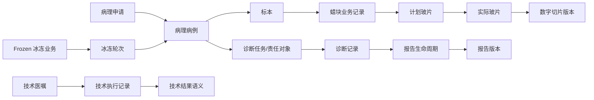

# PIS-Next V2 P00 当前系统审计

文档状态：已完成
文档版本：V2-0.1
审计日期：2026-08-08
审计范围：`D:\Projects\pis-next` 当前 Git 工作区
审计原则：净室设计；未读取、未分析任何外部旧 PIS 材料

## 1. 审计结论

当前仓库不是可运行的 PIS 系统，而是处于业务设计阶段的文档仓库：

- Git 分支为 `main`，审计开始时工作区干净，HEAD 为 `e304972`；
- `apps/backend`、`apps/frontend`、`infra`、`scripts`、`tests` 只有 `.gitkeep` 占位；
- 没有 Java、TypeScript、JavaScript、SQL、Docker Compose、CI 工作流或可执行配置；
- 没有实际数据库、迁移脚本、Service、Controller、API 实现、定时任务或自动化测试；
- 现有业务资产全部是项目、领域、场景、架构和决策文档；
- 现有 P05 文档登记了 63 个对象、18 个聚合和 70 条不变量，但这些是设计文本，不是运行时结构；
- 因此不存在需要立即删除的旧运行代码，也不存在可直接迁移的当前数据库；
- 现有 P05 文档仍承载一套与 V2 不完全一致的候选领域语义，应作为“待重构设计资产”隔离处理，不能直接转成 V2 代码。

这意味着本轮的主要风险不是代码回归，而是把旧设计语义未经审查地冻结成新数据库或新 API。

## 2. 当前仓库模块和工程资产

| 类别 | 当前发现 | 当前状态 | V2 处理 |
|---|---|---|---|
| 后端 | `apps/backend/.gitkeep` | 无代码、无模块 | KEEP 目录意图；V2 后端另设隔离入口 |
| 前端 | `apps/frontend/.gitkeep` | 无代码、无页面 | KEEP 目录意图；V2 前端另设隔离入口 |
| 数据库 | `docs/database/.gitkeep` | 无数据库、无迁移 | 暂不创建；由 P04 设计 |
| Service | 未发现 | 无应用服务实现 | P03 只定义所有权，P06 后实现 |
| Controller/API | `docs/api/.gitkeep` | 无 Controller、路由或 API 契约 | P06 规划 |
| 领域文档 | `docs/domain/*` | P03/P05 设计资产 | REFACTOR；V2 不直接继承冲突语义 |
| 工作流文档 | `docs/workflows/*` | 场景和问题依据 | REFACTOR；逐项映射 V2，不当作实现证明 |
| 架构文档 | `docs/architecture/*` | 高层系统边界 | KEEP/REFACTOR；保留净室、模块化单体和外部边界原则 |
| 决策文档 | `docs/decisions/*` | 已确认历史决策记录 | KEEP 作为历史约束；冲突项由 V2 基线重新审查 |
| 项目文档 | `docs/project/*` | P00-P05 进度和治理记录 | KEEP；增加 V2 独立状态，不覆盖历史记录 |
| API | `docs/api/.gitkeep` | 无契约 | P06 规划 |
| 领域事件/Outbox | 仅在文档中描述 | 无事件发布器、Outbox 或消费者 | KEEP 设计意图，P04/P06 后实现 |
| 定时任务 | 未发现 | 无 scheduler、job 或 worker | P06/P08 后按实际需求建立 |
| 测试 | `tests/.gitkeep`、`docs/testing/.gitkeep` | 无测试实现 | P08 规划 |
| 部署/运维 | `infra/.gitkeep`、对应文档占位 | 无部署实现 | KEEP 边界，后续补充 |
| 打印/报表 | 仅在业务文档中描述 | 无实现 | REFACTOR 为 PrintService、Report 和报表投影 |
| 权限/审计 | 仅在业务文档中描述 | 无实现 | KEEP 设计意图，按 V2 责任和敏感操作规则重建 |
| 集成 | 仅在系统上下文和场景中描述 | 无适配器 | REFACTOR 为外部集成与内部领域调用两条边界 |

## 3. 当前文档领域对象关系

现有 P05 文档形成的主要关系可以概括为：



说明：上图是对现有文档术语的审计归纳，不是 V2 目标设计。现有文档没有可运行代码来证明这些关系已经实现。

## 4. 旧领域语义识别

### 4.1 明确发现或可确认的冲突语义

| 现有语义 | 证据 | V2 处理 |
|---|---|---|
| `计划玻片` 与 `实际玻片` 并列 | `docs/domain/core-object-catalog.md` 中的 OBJ-017、OBJ-005 | DELETE 计划业务对象；V2 只保留 `Slide`，打印前即存在 |
| `报告生命周期` 包含 `报告版本` | OBJ-008、OBJ-009，且文档多处出现 `ReportVersion` | DELETE 嵌套版本模型；一次签发直接创建不可变 `Report`，重新签发创建新的 `Report` |
| `蜡块业务记录` | OBJ-004 及相关聚合描述 | REFACTOR 为稳定的 `Block` 业务对象；取材/形成/返工作为事实记录 |
| `诊断任务或诊断责任对象` | OBJ-006、AGG-009 | REFACTOR 为 `Assignment`、`ResponsibilityChain` 和持续编辑的 `Diagnosis` |
| 以技术执行记录和技术结果表达技术闭环 | OBJ-016 及技术流程文档 | REFACTOR 为 `TechnicalOrder`、`TechnicalRecord` 和具体输出；禁止万能 `TechnicalResult` |
| 通用“业务记录”分类承载核心语义 | P05 对象目录多处使用“业务记录” | REFACTOR；核心对象、事实记录、审计、质量和集成记录分别建模 |
| 标本容器/组织盒可能被提升为父层 | OBJ-038、OBJ-039 | REFACTOR；`Specimen` 是核心父层，容器只是承载/扩展信息 |

### 4.2 未发现的旧对象

在当前仓库文档中没有发现以下精确名称，也没有运行时代码可以证明其存在：

```text
PlannedBlock
ActualBlock
EmbeddingTask
ProcessingTask
SectioningTask
StainingTask
CoverslipTask
CaseStatus
```

但“处理批次”“设备任务”“技术任务”等相近概念在文档中出现。它们不能因为名称不同就自动成为 V2 允许的核心任务，须按 P01/P02 规则重新分类。

## 5. 资产分类

### KEEP

- 根目录 `AGENTS.md` 的患者安全、净室、模块化单体、数据完整性和测试门禁；
- `docs/index.md` 的文档治理、编号、状态和净室原则；
- `docs/architecture/system-context.md` 的外部边界和 PIS 不负责事项；
- 权限、审计、幂等、Outbox、锁、文件、日志、异常处理等设计意图；
- 现有业务场景、问题编号和决策台账作为待映射证据，不作为 V2 实现；
- Git、目录骨架和部署/CI 的预留位置。

### REFACTOR

- `docs/domain/core-object-catalog.md`：对象身份和层次按 P01 重建；
- `docs/domain/domain-relationships.md`、`aggregate-boundaries.md`：按 V2 聚合和来源链重写；
- `docs/domain/domain-invariants.md`：按 P02 重建并移除旧模型前提；
- 登记、取材、技术医嘱、诊断、报告、冰冻、数字切片、接口和工作台场景：逐项映射到 V2；
- `apps/backend`、`apps/frontend`：P03 后建立 V2 模块包，不把空目录误认为实现；
- `docs/project/MASTER_PLAN.md` 和 `progress.md`：后续可增加 V2 进度，不抹去历史阶段记录。

### DELETE / RETIRE FROM V2

以下概念不得进入 V2 核心代码、数据库或 API：

- `PlannedBlock`、`ActualBlock`、`PlannedSlide`、`ActualSlide`；
- `BlockBusinessRecord` 或用“业务记录”代替 Block 的核心命名；
- `Report -> ReportVersion` 的嵌套模型；
- 以脱水、包埋、切片、染色、封片为强制主流程的 Task 模型；
- `CaseStatus` 作为统一病例生命周期或工作台状态机；
- `TechnicalResult` 作为所有技术输出的万能容器；
- 用 Container 取代 Specimen 的核心父层模型。

现有历史文档暂不删除，避免破坏项目决策追溯；它们在 V2 中只作 REFACTOR 输入，待新领域稳定后按 P09/P10 的清理门禁处理。

## 6. V2 隔离和边界

本轮新增以下空目录作为隔离标记，不包含业务代码：

- `apps/backend-v2/`：后端 V2 包边界；
- `apps/frontend-v2/`：前端 V2 壳和工作区边界；
- `tests/v2/`：V2 测试隔离边界。

旧空目录不删除，避免扩大本轮范围。

## 7. 审计风险与结论

| 风险 | 严重性 | 处理 |
|---|---|---|
| 现有文档完成状态容易被误解为已有系统完成 | 高 | 明确“业务代码尚未开始”；V2 以事实审计为准 |
| 旧 P05 语义直接进入数据库 | 高 | P00-P03 通过前禁止建表和迁移 |
| 把场景中的技术动作做成 Task | 高 | P01/P02 固定 TechnicalRecord 为记录，默认不做诊断门槛 |
| 报告版本嵌套被保留 | 高 | P01 明确一次签发一个 Report |
| 迁移决策污染新领域 | 高 | P05 迁移计划与领域设计隔离，当前不读取旧数据 |

P00 结论：审计完成，仓库适合从文档层建立 V2 领域隔离；尚不具备任何业务代码、数据库或 API 开发准入。
