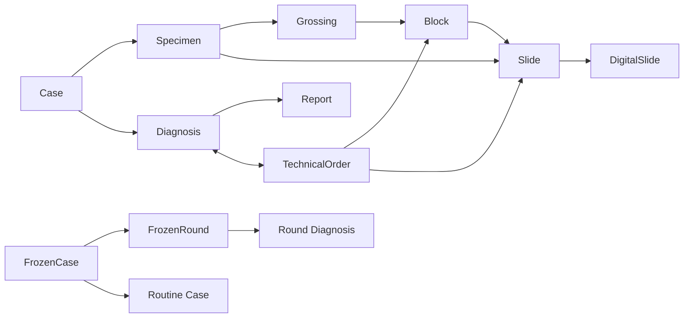

# PIS-Next V2 P01 核心领域模型

文档状态：已完成
文档版本：V2-0.1
完成日期：2026-08-08
前置：P00 审计

## 1. 模型目标

V2 的最小可理解主链是：

```text
Case → Specimen → Grossing → Block → Slide → Diagnosis → Report
```

诊断期间允许形成闭环：

```text
Diagnosis ↔ TechnicalOrder ↔ 新 Block / Slide / MolecularResult
```

物理技术节点是追溯记录，不能成为 PIS 的主人。工作台、质控、统计和提醒均从业务事实投影得出。

## 2. 核心身份

### 2.1 Case

`Case` 是一次拥有独立 `BusinessType` 和独立 `PathologyNo` 的病理业务。

- `caseId` 是永久稳定、不可业务修改的内部身份；
- `pathologyNo` 是可审计的业务编号，登记成功生成；
- `businessType` 配置化，至少支持 `ROUTINE`、`FROZEN`、`CYTOLOGY`、`MOLECULAR`、`CONSULTATION`、`SEND_OUT` 等业务类型；
- `lifecycle` 只保留 `ACTIVE`、`CANCELLED` 两个粗粒度生命周期；
- Frozen 和冰剩转常规是两个 Case；常规 Case 通过 `frozenSourceCaseId` 保留来源；
- 不创建 `BusinessRecord`，不创建统一细粒度 `CaseStatus`。

### 2.2 BusinessType 和 ApplicationItemMapping

`BusinessType` 是配置，而不是万能 BPM。它配置病理号规则、登记字段、取材能力、Block/Slide 规则、诊断/报告模板范围、技术项目、工作台路由和 QC 规则。

`ApplicationItemMapping` 将外部申请项目映射到业务类型：

```text
sourceSystem + externalItemCode + optional campus → businessType
```

映射失败时允许人工选择并记录责任，不得在接口代码中硬编码医院项目号与类型的 `if/else`。

### 2.3 Specimen

`Specimen` 属于 Case，Case 可有零到多个 Specimen。登记时通常创建，后续支持新增、受控修改和软删除。编号在 Case 内唯一，编号规则可配置。

Container、组织盒和其他承载物不成为核心父层；它们只在有实际追溯价值时作为承载或扩展信息。

## 3. 材料主链

### 3.1 Grossing

`Grossing` 属于 Case，不属于单个 Specimen。一条 Grossing 可处理一个 Case 的多个 Specimen，同一 Case 可有多次 Grossing。

- 原取材录错：reopen 原 Grossing，保留原事实和重开责任；
- 诊断后补取：新建 Grossing，并关联 `sourceTechnicalOrderId`；
- Grossing 完成后，以最终 Block 集合按 SlideRule 生成默认 Slide；
- Grossing 不是工作台总状态，也不要求每个物理步骤独立 Task。

### 3.2 Block

V2 只保留 `Block`：

- 在 Grossing 中创建；
- 属于 Case；
- 正常来源于 Specimen；
- 关联 `sourceGrossing`，可关联 `sourceTechnicalOrder`；
- Case 内业务编号唯一；
- 支持软删除和来源纠错，不做复杂状态机；
- 外院 Block 可缺少完整本地 Specimen lineage，但必须明确外部来源并保留核验事实。

### 3.3 Slide

V2 只保留 `Slide`，来源类型为 `BLOCK`、`SPECIMEN` 或 `EXTERNAL`。Slide 在打印前已经存在，打印和补打不创建新的 Slide。

- Grossing 完成后由 SlideRule 生成默认 HE Slide；
- Block 修改必须保持 Slide 关联业务一致；
- Slide 只需要足够表达 `completed` 与 `deleted/cancelled` 等业务事实，不建立 CUTTING、STAINING、COVERSLIPPING 等主生命周期；
- 软删除保留来源、责任、审计和打印历史。

### 3.4 生产上下文

Slide 可带轻量来源/上下文：`INITIAL_PRODUCTION`、`TECHNICAL_ORDER`、`FROZEN_ROUND`。这用于判断某组 Slide 是否完成，不回写 Case 生命周期。

- 初次 Slide 全完成可进入初诊；
- TechnicalOrder 输出 Slide 全完成后，医嘱结果返回；
- FrozenRound Slide 全完成后，该轮可诊断；
- 技术医嘱新增 Slide 不得错误回滚已经完成的初次制片事实。

## 4. 技术、数字和诊断领域

### 4.1 Print

打印链为：

```text
Business Action → PrintRule → PrintService → PrinterAdapter
```

PrintRule 配置内容和时机，PrintService 记录 PrintLog，PrinterAdapter 隔离具体 SDK。补打是同一业务对象的新打印事实，不是新 Block/Slide。

### 4.2 TechnicalOrder

TechnicalOrder 属于诊断循环，支持多个 Item、多个 Target，Target 可以是 Case、Specimen、Block 或 Slide。状态仅为：

```text
PENDING / EXECUTING / COMPLETED / CANCELLED
```

输出可以是新 Block、新 Slide、MolecularResult 或外送结果。新材料必须进入正式材料域，取消只取消订单/项目并按规则软删除不再需要的 Slide。

### 4.3 TechnicalRecord

脱水、包埋、切片、染色、封片等是配置化 TechnicalRecord 节点，不是 Case 的主任务。记录可跨 Case 关联多个 Block/Slide，保存批次、节点、操作者、设备、起止时间、材料和备注。默认不成为 Diagnosis 硬门槛。

### 4.4 DigitalSlide

`DigitalSlide` 必须有 `caseId`，`blockId`、`slideId` 可选。支持自动绑定、手工绑定、重新绑定和一张 Slide 多个 DigitalSlide。扫描进度是展示事实，不阻止 Diagnosis；PIS 不实现 WSI 存储和阅片底层。

### 4.5 Diagnosis、Responsibility 和 Assignment

Diagnosis 是持续编辑的诊断主体。普通 Case 原则上一份 main Diagnosis，FrozenRound 可有独立 Diagnosis。内容由 `DiagnosisTemplate` 和 `TemplateVersion` 配置，支持结构化字段、自由文本、重复组、表格、条件显示、依赖、计算、单位、排序和生成文本。

Responsibility 是累积责任链，不是 owner 转移：

```text
INITIAL → REVIEW → AUDIT
```

责任链保留所有责任人；当前编辑权属于当前责任环节。同一账号可承担多个角色，但每个角色分别留痕。Assignment 负责公共池、组池、手工/自动分配、自主认领和改派，本质是确定初诊 Responsibility。

## 5. 报告

`ReportTemplate` 与 `DiagnosisTemplate` 分离。ReportTemplate 可预览、切换，并从 Case、Specimen、Grossing、Diagnosis 和 Responsibility 取值。

一次 Sign-out 直接创建一份不可变 `Report`，不是 `Report → ReportVersion`：

```text
sign #1 → Report R001
withdraw
sign #2 → Report R002
```

每份 Report 保存 source data snapshot、渲染内容、模板、责任、签发人、签发时间、持久化 PDF 和打印输出。撤回只改变 Report 业务有效性，重新签发创建新 Report；补充报告可与原有效 Report 并存。

## 6. 特殊业务

- Frozen：一个 Frozen Case 下有多个 FrozenRound；每轮有 Specimen、取材、Slide、Diagnosis、Responsibility 和 Report。轮次签发后新增标本进入新轮次；Frozen End 创建新的 Routine Case 并设置 `frozenSourceCaseId`。
- Cytology：Registration → Case → Specimen → Slide → completion → Diagnosis → Report；Block 可选，Cell Block 使用统一 Block。
- Molecular：独立分子业务新建 Case 和 pathology number；原 Case 的追加检测走 TechnicalOrder → MolecularResult → 同 Case → supplemental/appended report。
- Consultation：外院会诊建立本地 Case 和本地 pathology number；External Slide/Block 可没有完整本地来源链，本院利用 External Block 制作的 Slide 属于本院 Slide。
- Send-out：沿用现有 Case，记录外送和外部结果；不得因外送创建新的本院 Case。

## 7. 归档、借用和查询投影

Block 和 Slide 各自拥有 `archiveLocation`、`currentDestination` 和 archive history。Loan 一单可包含多个材料，借出不覆盖原 archiveLocation；销毁改变材料状态，不删除 Case、Diagnosis 或 Report。

Workbench 使用 Query/Projection 服务从业务事实推导 `WAIT_GROSSING`、`WAIT_SLIDE`、`WAIT_DIAGNOSIS`、`MY_DIAGNOSIS`、`WAIT_REVIEW`、`WAIT_AUDIT`、`TECHNICAL_ORDER_RETURNED` 等展示值。这些不是 Case 生命周期。

Global Search Drawer 在任意页面可由 `Ctrl + K` 唤起，搜索 pathologyNo、患者引用、就诊、申请、Specimen、Block、Slide、Diagnosis、Report 和 TechnicalOrder，最终进入 Case context。

## 8. V2 核心来源链



任何返工、补取材、重切、重染、重扫或补充都必须追加新事实或新对象，不能覆盖原始来源和责任。
