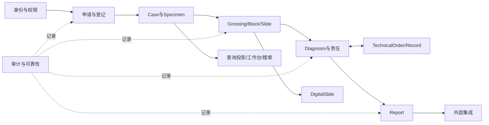

# PIS-Next V2 P03 模块边界

文档状态：已完成
文档版本：V2-0.1
完成日期：2026-08-08
架构基线：模块化单体

## 1. 总体原则

V2 采用模块化单体，不拆分未经批准的微服务。每个模块拥有自己的领域对象和写入边界；跨模块协作通过应用服务、领域事件或公开查询接口完成，不直接修改其他模块的表或内部对象。



## 2. 模块所有权

| 模块 | 拥有的核心事实 | 可调用 | 禁止 |
|---|---|---|---|
| `identity-access` | User、Role、Permission、Organization、Campus、数据范围、敏感操作授权 | 所有应用模块 | 直接替代业务责任或修改病例事实 |
| `configuration` | BusinessType、编号规则、ApplicationItemMapping、模板配置、PrintRule、QC 规则 | 登记、材料、诊断、报告、接口 | 变成任意 BPM；运行时覆盖已签发快照 |
| `application-intake` | Application、外部项目映射、幂等接收和申请取消 | Case、Integration、Audit | 直接创建 Block/Slide/Report |
| `case-specimen` | Case、Specimen、来源关系、pathology number、Frozen 来源链接 | Application、Grossing、Diagnosis、Archive | 把工作台状态写入 Case；拥有报告或技术任务 |
| `grossing-material` | Grossing、Block、Slide、来源、完成事实、软删除、材料标签动作 | Case、Print、TechnicalOrder、DigitalSlide、Archive | 创建 Planned/Actual 双模型；修改 Case 生命周期 |
| `technical` | TechnicalOrder、Item、Target、TechnicalRecord、具体输出协调 | Diagnosis、Material、Molecular、Integration | 用 Generic TechnicalResult 吞并输出；把物理节点默认变成主 Task |
| `diagnosis-responsibility` | Diagnosis、DiagnosisTemplate 运行快照、ResponsibilityChain、Assignment、Workbench 查询 | Case、Material、Technical、Report、Search | 直接写 Report；以 owner-transfer 覆盖责任链 |
| `report` | ReportTemplate、Preview、不可变 Report、签发/撤回/补充/重新签发 | Diagnosis、Integration、File、Print、Audit | 创建 ReportVersion 子模型；模板改写历史 Report |
| `digital-slide` | DigitalSlide、绑定/重绑定、扫描元数据和访问审计 | Slide、Case、File、Viewer Adapter | 实现 WSI 存储或阻断诊断 |
| `frozen` | FrozenRound、轮次材料、轮次诊断/责任/报告协调、冰剩来源 | Case、Material、Diagnosis、Report | 把轮次当 Case 生命周期；覆盖普通 Case |
| `cytology` | 细胞学制备记录、条件性制备物、筛查/复核事实 | Case、Specimen、Slide、Diagnosis | 强制为所有细胞学创建 Block 或统一 Task |
| `molecular` | Molecular task/run/QC/result/interpretation，独立与附属分子身份 | Case、Technical、Material、Report、Integration | 把设备结果直接当临床结果；吞并原病例身份 |
| `referral-sendout` | Consultation、Send-out、External Material、External Result 核验 | Case、Specimen、Material、Report、Integration | 将外部事实伪装成本地执行；外送新建本院 Case |
| `archive-loan` | Block/Slide archive location、destination、history、Loan、销毁证据 | Material、Case、Audit | 使用统一 Case archiveLocation；物理删除医疗事实 |
| `print-file` | PrintLog、标签/报告打印、File 元数据、PrinterAdapter 边界 | Material、Report、DigitalSlide | 通过打印创建 Slide；绑定具体 SDK 到核心领域 |
| `integration-reliability` | Inbox/Outbox、Idempotency、重试、死信、重放、对账、外部映射 | 所有外部集成模块 | 直接写核心业务表；以外部状态回滚内部事实 |
| `audit-operations` | Audit、Locking、异常、质量事件、操作日志、运维检查 | 所有模块 | 代替业务模块作隐式纠错；输出敏感信息 |
| `projection-search-reporting` | Workbench projection、Global Search、QC/统计读模型、外挂报表数据集 | 只读访问各模块公开查询 | 写回 CaseStatus；把投影当 Source of Truth |

## 3. 聚合和事务边界

- Case 与 Specimen 身份及来源在 `case-specimen` 内保护；Grossing、Block、Slide 各自保持独立生命周期。
- Diagnosis、ResponsibilityChain、Assignment 的写操作由 `diagnosis-responsibility` 保护；Report 只接收已授权的签发命令。
- TechnicalOrder 取消、完成和输出协调由 `technical` 保护，具体 Block/Slide 创建仍通过材料模块命令完成。
- 外部消息接收先落 `integration-reliability` 的原始/幂等事实，再通过应用命令进入拥有者模块；外部失败不得回滚已经提交的业务事实。
- 跨聚合动作必须定义事务、并发控制和失败补偿；不能依赖前端连续请求的偶然顺序。

## 4. 依赖规则

允许：

1. 上层应用模块调用下层公开命令或查询；
2. 领域事件只传递稳定身份和业务事实，不传递可变内部对象；
3. Projection 使用只读查询或事件构建，不拥有源数据；
4. Audit、Locking、Outbox、File 等横向能力通过端口/适配器使用。

禁止：

1. Controller 直接修改领域状态；
2. 一个模块直接写另一个模块的数据库表；
3. 前端提交 `caseStatus`、`completed` 等关键状态绕过领域命令；
4. 外部适配器直接写 Case、Diagnosis、Report 或材料核心事实；
5. 用 JSON/EAV/通用多态外键替代核心关系；
6. 为每家医院复制一套业务模块或写项目号 `if/else`。

## 5. V2 包隔离

当前只建立目录边界：

```text
apps/backend-v2/
apps/frontend-v2/
tests/v2/
```

P04 以后可在 `apps/backend-v2` 内按上述模块建立英文包名；具体 Java/前端技术实现沿用仓库既定技术栈，若发现现有技术栈不足，必须另行记录 ADR，不在本轮擅自更换。

## 6. 模块完成门禁

模块进入实现前必须具备：对象所有权、不变量、命令边界、并发策略、审计点、异常补偿、权限数据范围和测试出口。只定义页面或 Controller 不视为模块完成。
