# P06 全病理业务流程衔接与业务流图

状态：P06已设计
本文件定义流程之间传递的业务对象、条件、责任和失败影响。图中只使用业务概念，不把具体系统实现当作流程节点。

## 1. 衔接登记规则

每条衔接必须同时记录：上游流程、下游流程、传递对象、传递条件、责任交出方、责任接收方、是否签收、失败影响范围、异常入口和关联不变量。传递对象是已形成的业务事实或事实引用，不是一个可被下游任意改写的共享状态。

## 2. 全病理业务分流总览

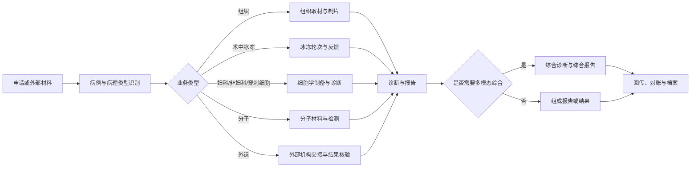

## 3. 组织病理衔接

| 上游流程 | 下游流程 | 传递对象 | 传递条件 | 责任交出方 | 责任接收方 | 是否签收 | 失败影响范围 | 异常入口 | 关联不变量 |
|---|---|---|---|---|---|---|---|---|---|
| P06-PROC-001 | P06-PROC-002 | 病理申请和原始入站事实 | 来源、患者/就诊上下文可核验 | 申请接收人员 | 病例建立人员 | 是 | 当前申请 | P06-PROC-001-E01 | P05-INV-001、P05-INV-002 |
| P06-PROC-002 | P06-PROC-003 | 病例和病理类型识别事实 | 病例编号已正式生效 | 病例建立人员 | 标本接收人员 | 是 | 当前病例及其标本 | P06-PROC-002-E02 | P05-INV-006、P05-INV-007 |
| P06-PROC-003 | P06-PROC-006 | 组织标本和责任交接 | 逐标本核对完成 | 标本接收人员 | 取材责任人 | 是 | 当前组织标本 | P06-PROC-003-E02 | P05-INV-009、P05-INV-019 |
| P06-PROC-006 | P06-PROC-007 | 蜡块业务记录和组织处理输入 | 取材记录和材料关系完整 | 取材责任人 | 组织处理人员 | 是 | 对应材料/批次 | P06-PROC-006-E02 | P05-INV-010、P05-INV-011 |
| P06-PROC-007 | P06-PROC-008 | 物理蜡块和完成事实 | 包埋完成且物理材料可定位 | 组织处理人员 | 技术执行人员 | 是 | 对应蜡块 | P06-PROC-007-E02 | P05-INV-012、P05-INV-013 |
| P06-PROC-008 | P06-PROC-009 | 实际玻片和扫描候选 | 实际玻片形成且扫描被选择 | 技术执行人员 | 扫描责任人 | 是 | 对应玻片/扫描任务 | P06-PROC-008-E03 | P05-INV-014、P05-INV-016 |
| P06-PROC-008 | P06-PROC-010 | 染色/封片后的实际玻片 | 玻片可用于诊断，扫描可不发生 | 技术执行人员 | 诊断责任人 | 是 | 对应玻片和诊断任务 | P06-PROC-008-E02 | P05-INV-015、P05-INV-017 |
| P06-PROC-010 | P06-PROC-011 | 诊断记录和报告输入 | 诊断复核责任已完成 | 诊断责任人 | 报告签发人员 | 是 | 当前诊断和报告 | P06-PROC-010-E02 | P05-INV-024、P05-INV-028 |
| P06-PROC-011 | P06-PROC-033 | 签发报告版本 | 版本签发完成 | 签发人员 | 回传责任人 | 是 | 当前回传事件 | P06-PROC-033-E01 | P05-INV-029、P05-INV-037 |

### 组织业务路径

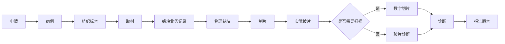

## 4. 术中冰冻衔接

| 上游流程 | 下游流程 | 传递对象 | 传递条件 | 责任交出方 | 责任接收方 | 是否签收 | 失败影响范围 | 异常入口 | 关联不变量 |
|---|---|---|---|---|---|---|---|---|---|
| P06-PROC-002 | P06-PROC-012 | 冰冻业务请求和病例关系 | 冰冻目的、轮次责任明确 | 病例建立人员 | 冰冻协调人员 | 是 | 当前冰冻业务 | P06-PROC-012-E01 | P05-INV-034、P05-INV-035 |
| P06-PROC-012 | P06-PROC-013 | 冰冻轮次和实际材料 | 轮次和材料已核对 | 冰冻协调人员 | 冰冻技术/诊断人员 | 是 | 当前轮次 | P06-PROC-012-E02 | P05-INV-034、P05-INV-036 |
| P06-PROC-013 | P06-PROC-014 | 冰剩材料和正式冰冻报告 | 初步反馈与正式报告边界明确 | 冰冻诊断人员 | 常规处理责任人 | 是 | 冰剩材料或当前病例 | P06-PROC-013-E02 | P05-INV-035、P05-INV-036 |
| P06-PROC-013 | P06-PROC-033 | 冰冻报告版本 | 正式签发完成 | 冰冻签发人员 | 回传责任人 | 是 | 当前回传 | P06-PROC-033-E02 | P05-INV-029、P05-INV-037 |

### 冰冻业务路径

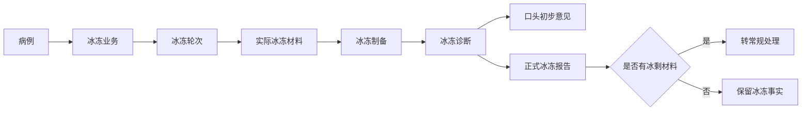

## 5. 细胞病理衔接

| 上游流程 | 下游流程 | 传递对象 | 传递条件 | 责任交出方 | 责任接收方 | 是否签收 | 失败影响范围 | 异常入口 | 关联不变量 |
|---|---|---|---|---|---|---|---|---|---|
| P06-PROC-002 | P06-PROC-015 | 细胞病例和标本分类 | 妇科/非妇科/穿刺来源明确 | 病例建立人员 | 细胞学接收人员 | 是 | 当前细胞病例 | P06-PROC-015-E01 | P05-INV-049、P05-INV-050 |
| P06-PROC-015 | P06-PROC-016 | 细胞学标本和制备请求 | 标本身份、来源和制备目的明确 | 细胞学接收人员 | 制备责任人 | 是 | 当前标本 | P06-PROC-015-E02 | P05-INV-050、P05-INV-051 |
| P06-PROC-016 | P06-PROC-017 | 制备记录和实际制备物 | 直接涂片、液基、离心或沉渣已记录 | 制备责任人 | 保存/复用责任人 | 是 | 当前制备物（如建立） | P06-PROC-016-E02 | P05-INV-052、P05-INV-053 |
| P06-PROC-016 | P06-PROC-019 | 实际玻片和制备记录 | 玻片已形成 | 制备责任人 | 充分性责任人 | 是 | 对应制片 | P06-PROC-016-E03 | P05-INV-014、P05-INV-054 |
| P06-PROC-019 | P06-PROC-020 | 充分性评价 | 评价完成并可筛查 | 充分性责任人 | 筛查责任人 | 是 | 当前筛查任务 | P06-PROC-019-E02 | P05-INV-055、P05-INV-056 |
| P06-PROC-020 | P06-PROC-021 | 筛查、复核和质量抽查记录 | 筛查资格、复核要求明确 | 筛查/复核人员 | 诊断责任人 | 是 | 当前诊断任务 | P06-PROC-020-E02 | P05-INV-057、P05-INV-058 |
| P06-PROC-021 | P06-PROC-022 | 细胞学诊断/报告输入 | 诊断复核完成 | 诊断责任人 | 关联检测责任人 | 是 | 当前关联检测或报告 | P06-PROC-021-E02 | P05-INV-059、P05-INV-060 |

### 细胞业务路径

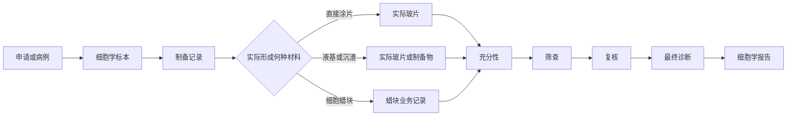

## 6. 分子病理衔接

| 上游流程 | 下游流程 | 传递对象 | 传递条件 | 责任交出方 | 责任接收方 | 是否签收 | 失败影响范围 | 异常入口 | 关联不变量 |
|---|---|---|---|---|---|---|---|---|---|
| P06-PROC-023 | P06-PROC-024 | 独立/附属分子检测任务 | 关系和任务前置条件明确 | 分子病例责任人 | 材料选择责任人 | 是 | 当前检测任务 | P06-PROC-023-E03 | P05-INV-063、P05-INV-064 |
| P06-PROC-024 | P06-PROC-025 | 实际材料、派生材料和剩余量 | 材料选择与消耗完成 | 材料责任人 | 提取责任人 | 是 | 对应材料/任务 | P06-PROC-024-E02 | P05-INV-063、P05-INV-064 |
| P06-PROC-025 | P06-PROC-026 | 可用 DNA/RNA/分析物和质量评价 | 提取物可用性已确认 | 提取责任人 | 运行负责人 | 是 | 对应任务 | P06-PROC-025-E02 | P05-INV-064、P05-INV-065 |
| P06-PROC-026 | P06-PROC-027 | 运行、批次、质控和原始结果 | 运行与质控接受性已明确 | 运行/质量人员 | 结果接收人员 | 是 | 对应任务或批次 | P06-PROC-026-E02 | P05-INV-066、P05-INV-067 |
| P06-PROC-027 | P06-PROC-030 | 有效结果和医学判读 | 有效性与判读责任明确 | 判读人员 | 分子签发人员 | 是 | 当前分子报告 | P06-PROC-027-E02 | P05-INV-063、P05-INV-068 |
| P06-PROC-028 | P06-PROC-024 | 复测/补测方向和剩余材料 | 失败影响与新任务关系明确 | 质量/病例责任人 | 材料责任人 | 是 | 新任务及原失败链 | P06-PROC-028-E03 | P05-INV-036、P05-INV-064 |
| P06-PROC-029 | P06-PROC-027 | 外部结果和核验结论 | 外部来源与材料已核验 | 外送/核验人员 | 结果接收/判读人员 | 是 | 当前外部结果用途 | P06-PROC-029-E03 | P05-INV-062、P05-INV-070 |

### 分子业务路径

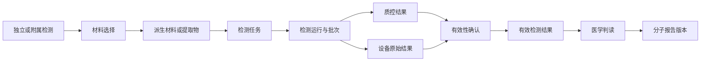

## 7. 外送检测衔接

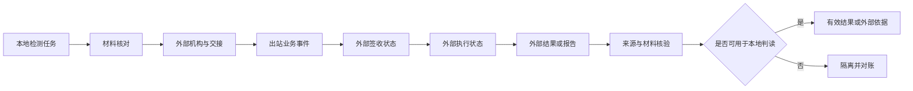

外送流程的失败影响通常限于当前材料、当前检测任务、出站事件或结果关联；不得因外部迟延自动撤销已形成的本地申请、病例或材料事实。

## 8. 多模态综合报告衔接

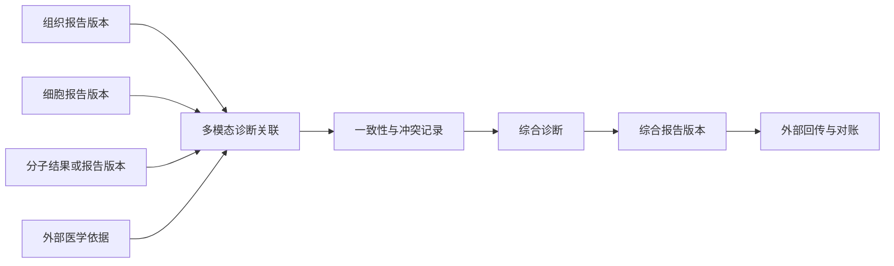

综合报告只引用组成版本，组成报告仍保持独立生命周期。

## 9. 报告生命周期

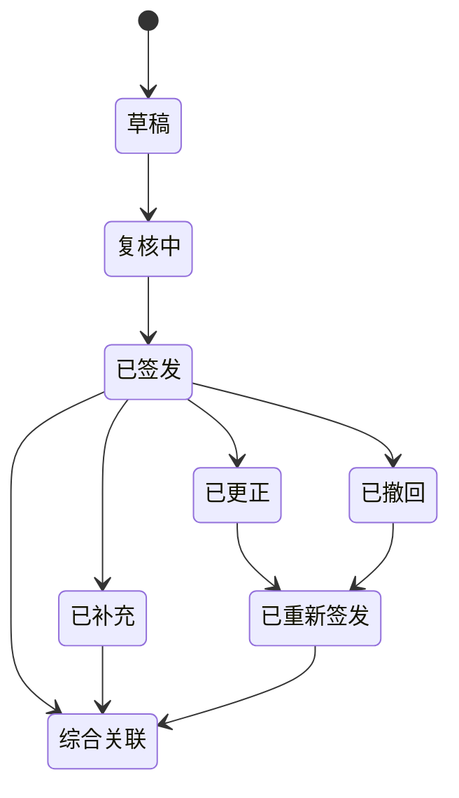

图示表达报告版本之间的业务关系；每个新版本均保留原版本、依据和责任链。

## 10. 接口投递和对账

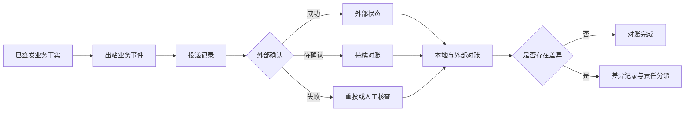

## 11. 受控纠错

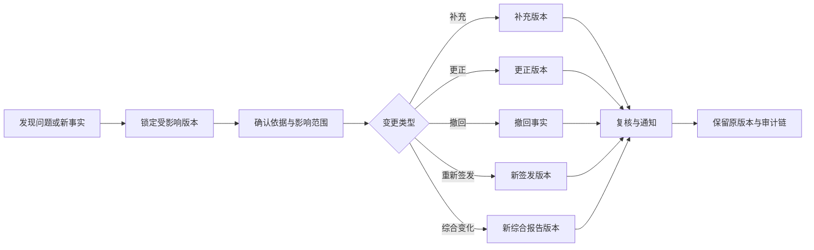

## 12. 档案销毁和恢复

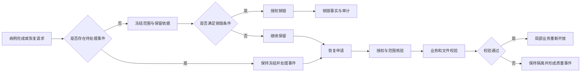

## 13. 交接的统一完成条件

只有在传递对象、来源版本、责任交出方、责任接收方、签收状态和失败影响范围均已形成时，衔接才可标记完成。下游失败只改变下游处理方向，不删除或回滚上游已经形成的申请、病例、材料、运行、结果或报告事实。
